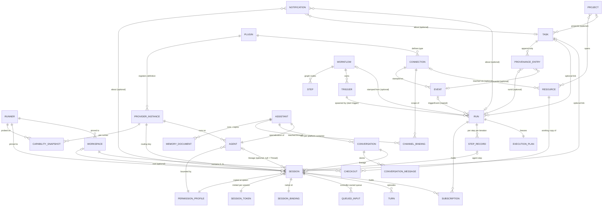

# Domain model

This document pins the shape of every Hercule domain entity: the fields the design tickets fixed, the relationships between entities and which of them are optional, the one fixed status axis each entity carries, the identity rules (Hercule ids versus provider-native and external ids), and the platform events each entity emits. Where another document owns a record's field list (Run, Step record, Notification, SessionSpec, Trigger, event envelope, memory documents, permission profiles), this document keeps purpose, relationships, status axis and identity and links the owner for the fields. Behaviour belongs to the owning subsystem document and is only pointed at here. The vocabulary is the glossary in [CONTEXT.md](../../CONTEXT.md); this document does not restate definitions.

## Model-wide rules

These rules hold for every entity below.

1. **All links are optional; no mandatory parents.** A session needs no task, run, workspace, or conversation. A run needs no task or workflow. A task needs no project. Every relationship in this document is optional unless it says "required". Rationale: the predecessor's mandatory `task_id` was its biggest structural mistake ([Domain model & ubiquitous language](https://github.com/theagenticage/hercule/issues/6)).
2. **One fixed status axis per entity, no user-definable domain states.** Where an entity has a status, its enum is fixed by this document or the owning document it links. No entity accepts user-defined states. Kanban-style groupings, "needs a call", "proposed", tiers like Now / Today / When you can, and topic tabs are presentation over labels and fixed fields, never domain states.
3. **Labels are not states.** Labels are bare strings in a flat namespace, created implicitly on first use. There is no label registry entity; the core blesses no label (shipped workflows may use conventional ones such as `proposed`; topics are labels). Colours and descriptions of labels are presentation. A label never gates, transitions, or auto-derives a status.
4. **The controller owns all domain state; runners own material state.** Every entity here is a row in the controller's one SQLite database ([04-state-store.md](./04-state-store.md)). Workspace files, provider-native session data and the runner's event outbox live on runner disk and are referenced from the controller only by id ([03-controller-and-runners.md](./03-controller-and-runners.md), [ADR 0002](../adr/0002-orchestration-stays-on-the-controller.md)).
5. **Controller records hold no absolute paths; runner paths are runner-owned facts keyed by id.** The rules are in [04-state-store.md](./04-state-store.md) (Relocatable Data Root).
6. **Every mutation is actor-stamped** (`user` or `session:<id>`) in the event log; no entity carries a separate audit trail ([11-public-api-and-agent-surface.md](./11-public-api-and-agent-surface.md)).
7. **Secrets are references.** Fields marked "secret" hold a reference into the owner-scoped secrets table; the value never appears in any entity row, log line or API response ([13-security.md](./13-security.md)).
8. **Single user, widen later.** No entity carries an owner or tenant column in v1. The `actor` field and the user record are the places a later multi-user model widens; nothing else may assume "the user".
9. **Sessions copy, never reference.** An Agent supplies values at spawn; the Session row holds its own copy of everything that shaped it (its `spec`, its `permissionProfileId`), and no property of a running or past session is ever read through its `agentId`. `agentId` is lineage. A session with no agent at all is a Thread (below). Reassigning an agent's profile or changing its defaults affects sessions spawned afterwards; editing a profile's grants applies live, because the session points at the profile row ([ADR 0030](../adr/0030-sessions-copy-their-configuration-and-a-thread-has-no-agent.md); resolved 2026-09-01, [Domain model residue](https://github.com/theagenticage/hercule/issues/46)).

**Ids** (resolved 2026-09-01, [Domain model residue](https://github.com/theagenticage/hercule/issues/46)): every Hercule-owned entity is identified by a **UUIDv7** minted by the controller, stored as a 16-byte primary key and rendered as the canonical lowercase string on the wire, in typed references (`run:<uuid>`, `session:<uuid>`), in actor stamps and in branch names. The one exception is the Event, whose `id` is the integer log position ([08-events-and-connections.md](./08-events-and-connections.md)); per-session stream rows are keyed by (session, position). Where a human reads or types an id, the short form is the **last eight hex characters** (the random tail; the head is a timestamp shared by every id minted in the same minute), and the CLI accepts a full id or an unambiguous tail of eight or more characters (`conflict` if ambiguous). Rationale and storage rules: [04-state-store.md](./04-state-store.md).

## Entity-relationship overview

In prose, the model has five clusters:

- **Work triangle**: Task (intent), Run (execution of a plan), Session (agent conversation). Any two are linked only when the link is meaningful; links live on the Run and Session side, and a Task's runs and sessions are derived by query.
- **Automation**: Workflow owns Triggers and Steps; a Run freezes an Execution Plan and holds Subscriptions; Events flow through one pipeline stamped with their Connection; Notifications are the output to the user.
- **Actors and access**: Agent (with a Permission Profile), Assistant (an Agent plus Conversations, Channel Bindings and Memory), Thread (a session the user drives with no Agent), Platform Identities (owner / trusted), Actor stamps, Session Tokens, API Keys, Grants and Permission Requests.
- **Organization**: Project spans Resources; Resources are checked out into Workspaces on Runners as Checkouts; Resources may reference the Connection that reaches them.
- **Infrastructure and extension**: Controller identity, Runners (with states and capabilities), Provider instances with Capability Snapshots, Plugins with their state, Connections, Secrets.

## Work

### Task

Purpose: the thin, work-type-agnostic work item that triage produces and workflows consume ([ADR 0019](../adr/0019-the-task-model-is-thin-workflows-own-task-semantics.md)).

Fields (pinned):

| Field | Type | Notes |
|---|---|---|
| `id` | Hercule id | |
| `title` | string | |
| `description` | markdown | Enrichment edits this; no comment thread in v1 |
| `status` | enum | Fixed axis, below |
| `priority` | enum | `urgent` / `high` / `normal` / `low`; optional, default `normal`; user and agents write the same field through the same op |
| `labels` | string[] | Bare strings, flat namespace, implicit creation |
| `projectId` | Hercule id, optional | At most one project |
| `provenance` | Provenance entry[] | Append-only |
| `createdAt`, `updatedAt`, `statusChangedAt` | timestamps | `statusChangedAt` moves only when `status` changes |
| `deletedAt` | timestamp, optional | soft delete: set by `task.delete`, the row stays (Deletion rules, below) |

Not present in v1: assignee, subtasks, task-to-task dependencies, comments, a suggested-priority shadow field (the actor-stamped event log serves that need).

Status axis: `open` -> `in-progress` -> `done`, plus `cancelled`. Any-to-any transitions; no state machine enforcement; no core auto-transitions; no completion gating. Status changes only via an explicit `task.update`. "Done means the PR merged" is a shipped-workflow convention implemented by the work run's own signal trigger and a final `task.update` step ([09-tasks.md](./09-tasks.md)). `cancelled` means decided not to do; delete (soft, `deletedAt`) means it should never have existed: the row stays for history, `task.read` answers `not_found`, and the event log keeps the audit (Deletion rules, below).

Relationships: `projectId` optional. Run and Session links to a task live on the Run and Session rows; the task's run and session lists are derived by query. Proposal (a Task labelled `proposed` plus its pending decision Notification) and Topic (a label) are vocabulary over this row, not fields.

Identity: Hercule id only. External refs live in provenance and are never unique across tasks.

Platform events: `task.created` carries a full snapshot; `task.updated` carries `{taskId, changes}` where `changes` holds `{old, new}` per changed scalar field and `{added, removed}` per changed array field; one update op emits exactly one event; provenance-only appends also emit `task.updated`. `task.deleted` carries `{taskId, snapshot}`, the final row, because nothing can read it afterwards. The actor is the envelope's `actor` field, not repeated in the payload ([08-events-and-connections.md](./08-events-and-connections.md), [09-tasks.md](./09-tasks.md)).

### Provenance entry

Purpose: one append-only record of an event, run or external thing that created or touched a task.

Shape (pinned): `{ ref?: ExternalRef, eventId?: Hercule id, runId?: Hercule id, at: timestamp, actor: Actor }`. Entries are never edited or removed.

External Ref canonical form: a fully-qualified id `<type>:<kind>:<identity>`, for example `github:issue:owner/repo#42`, `gmail:thread:<id>`, `sentry:issue:123`. The plugin that defines the type owns canonicalization. The Connection an event arrived through is excluded from the identity. No uniqueness constraint across tasks: the `task.query` guard convention treats "any open task with this ref" as the duplicate signal ([09-tasks.md](./09-tasks.md), [10-triage-intake-and-notifications.md](./10-triage-intake-and-notifications.md)). Refs typically originate from the event envelope's `refs` field and are copied here by triage.

Relationships: `eventId` points into the event log (the referenced event may be TTL-pruned; the entry survives), `runId` into Runs.

An entry MUST carry at least one of `ref`, `eventId`, `runId` (`validation` otherwise; resolved 2026-09-01, [Domain model residue](https://github.com/theagenticage/hercule/issues/46)): `{at, actor}` alone says nothing the actor-stamped `task.updated` event does not. A hand-made task simply has an empty provenance list.

### Run

Purpose: one execution of a frozen Execution Plan, the only thing called a run ([ADR 0001](../adr/0001-runs-freeze-an-execution-plan.md)).

Fields: the run record is owned by [07-workflows.md](./07-workflows.md) (section 7.2): `id`, `workflowId | null`, frozen `plan`, resolved `inputs`, `workspaceId?` and `runnerId?` (the run's one workspace and runner, once pinned), `origin` (trigger / manual / action / api), `triggerEvent` (a copy of the triggering event, surviving event-log pruning), ~~`rerunOf`~~ `originalRunId` *(renamed 2026-09-27, [#81](https://github.com/theagenticage/hercule/issues/81))*, `status`, `failureReason` (closed set: `validation-error`, `expression-error`, `iteration-limit`, `schema-failure`, `step-failed`, `session-failed`, `workspace-failed`), `failedStepId`, `steps[]` (step records), `createdAt`, `startedAt`, `finishedAt`. Ticket 13 pins the content (frozen plan, resolved inputs, triggering event, per-step records, failure reason); the names are 07's consolidation; the execution semantics are [Workflow execution semantics](https://github.com/theagenticage/hercule/issues/36)'s. This document adds one optional link: `taskId` (the all-links-optional work triangle; the task's run list is derived from it).

How a run was started is `origin` plus `triggerEvent`; the check-in view's provenance-first ranking (started by you > standing workflow > routine schedule) needs no further field ([14-web-app.md](./14-web-app.md)).

Status axis (mirrored from 07): `pending` -> `running` -> terminal `completed` | `failed` | `cancelled`. `pending` is the effect row the event matcher inserts before the run is scheduled ([ADR 0009](../adr/0009-all-events-flow-through-one-persisted-pipeline.md)). *(amended 2026-09-28, [#82](https://github.com/theagenticage/hercule/issues/82): the matcher's row is a trigger effect, not the run; the run is written `pending` when the effect is delivered, [07-workflows.md](./07-workflows.md) section 2.1)* *(Amended 2026-09-24, [#79](https://github.com/theagenticage/hercule/issues/79): a run started by request is `pending` from the request that writes it until the run engine takes it up; [07-workflows.md](./07-workflows.md) section 7.2.)* A run blocked on a signal is `running` with nothing running and a live Subscription; "waiting" is a derived view. `failed` is terminal (recovery is re-run). The user may cancel at any time; a run's Subscriptions live exactly until it reaches a terminal state. A run takes place in one workspace on one runner ([07-workflows.md](./07-workflows.md) section 4.4).

Re-run: whole-run only, two modes (replay the frozen plan, or re-stamp from the current workflow with the same inputs; the latter is the default). Both create a new Run referencing the original through ~~`rerunOf`~~ `originalRunId` *(renamed 2026-09-27, [#81](https://github.com/theagenticage/hercule/issues/81))*.

Relationships: `workflowId` optional; `taskId` optional; `workspaceId` and `runnerId` optional (set when the first ~~agent step~~ workspace step starts *(amended 2026-09-25, [#257](https://github.com/theagenticage/hercule/issues/257): a workspace step is an agent step or a workspace action; [ADR 0035](../adr/0035-an-action-declares-where-it-runs.md))*); agent steps link to Sessions from their step record; holds zero or more Subscriptions.

Identity: Hercule id.

Platform events: `run.completed`, `run.failed`, `run.cancelled`; payloads owned by [08-events-and-connections.md](./08-events-and-connections.md). Cancellation is not a failure and has its own kind. These are the only run kinds in v1; kinds grow additively.

*(Amended 2026-09-24, [#79](https://github.com/theagenticage/hercule/issues/79).)* Runs exist now, with the fields [07-workflows.md](./07-workflows.md) section 7.2 lists as built. `taskId` is not on the run yet; it joins with the ticket that links a run to a Task. `workspaceId`, `runnerId`, `triggerEvent` ~~and `rerunOf`~~ join with the tickets that set them~~, and the platform events with [#81](https://github.com/theagenticage/hercule/issues/81)~~. *(Amended 2026-09-27, [#81](https://github.com/theagenticage/hercule/issues/81): `originalRunId` (the provisional `rerunOf`) and the three run platform events are built, [07-workflows.md](./07-workflows.md) sections 7.3 and 7.4.)*

*(Amended 2026-09-28, [#82](https://github.com/theagenticage/hercule/issues/82).)* `triggerEvent` and the `trigger` origin are built. So is the failure reason `validation-error`, for a run a start trigger starts when its workflow or the inputs mapped from the event do not validate ([07-workflows.md](./07-workflows.md) sections 7.1 and 7.2).

*(Amended 2026-10-04, [#83](https://github.com/theagenticage/hercule/issues/83).)* Agent steps and signal triggers are built. The failure reasons `schema-failure` and `session-failed` are built with them, so every reason in the closed set is now built. A run lists its live run-held Subscriptions as `subscriptions`. An agent step's Session links back to the run with `runId` and `stepId`, and the step record names the session with `sessionId` ([07-workflows.md](./07-workflows.md) sections 4.2 and 7.2).

#### Execution Plan

Purpose: the executable content a run executes, frozen at run start. Contents: input declarations, the step graph (steps with their `join` and `terminal` flags, edges with conditions and `maxTraversals`), the signal triggers the run will instantiate as Subscriptions (source nodes of the graph), the workspace policy ~~and placement inputs~~ (*amended 2026-09-24, [#79](https://github.com/theagenticage/hercule/issues/79)*, below), and the action references. Stored inline on the Run; never shared between runs and never edited. Editing a workflow never affects an existing plan. Shape and validation rules: [07-workflows.md](./07-workflows.md).

*(Amended 2026-09-24, [#79](https://github.com/theagenticage/hercule/issues/79).)* The plan is stored inline on the Run as the parsed workflow definition (the contract's `WorkflowDefinition`), `name` and `description` included, so a run can be named and drawn after its workflow is renamed or deleted. There are no placement inputs to freeze: the definition has no `runner` field ~~until agent steps run ([#83](https://github.com/theagenticage/hercule/issues/83))~~. Agent steps run without one: a run with an agent step is pinned to a runner that hosts the Agent's provider instance, as any run with a workspace step is pinned *(amended 2026-10-04, [#83](https://github.com/theagenticage/hercule/issues/83))*.

#### Step record

Purpose: what one node (step or signal trigger) did in one iteration of one run.

Fields: owned by [07-workflows.md](./07-workflows.md) (`StepRecord`): `stepId` (a step id or a signal trigger id), `iteration`, `status`, `startedAt`, `finishedAt`, `output`, `sessionId` (agent steps), `error`. The triage agent's stored structured verdict that Intake surfaces is the `output` of the triage agent step ([10-triage-intake-and-notifications.md](./10-triage-intake-and-notifications.md)). A signal node gets one ~~`completed`~~ record per firing, holding its mapped event. The Event Router writes it `pending` when an event matches, and the run marks it `completed` as it fires the node's edges *(amended 2026-10-04, [#83](https://github.com/theagenticage/hercule/issues/83))*.

Status axis (mirrored from 07), monotonic per record: `pending` (a queued iteration behind a busy step) -> `running` -> `completed` | `failed` | `cancelled`; `skipped` is set at creation and final. A re-entered step never leaves `completed`: the next iteration is a new record.

*(Amended 2026-09-24, [#79](https://github.com/theagenticage/hercule/issues/79).)* A step record is `pending` from its creation until its action is called, not only as a queued iteration. `error` is `{ code, message }`, not a string. ~~`skipped` is not built yet ([#80](https://github.com/theagenticage/hercule/issues/80)).~~ `skipped` is built, and is not set at creation: a record moves `pending → skipped` when its step's condition is false as the record would start *(amended 2026-09-25, [#80](https://github.com/theagenticage/hercule/issues/80))*. The rules as built are in [07-workflows.md](./07-workflows.md) section 7.2.

### Session

Purpose: one provider-backed agent conversation, resumable and forkable, the only place agent work happens.

Fields (pinned across [#6](https://github.com/theagenticage/hercule/issues/6), [#7](https://github.com/theagenticage/hercule/issues/7), [#12](https://github.com/theagenticage/hercule/issues/12), [#16](https://github.com/theagenticage/hercule/issues/16), [#17](https://github.com/theagenticage/hercule/issues/17); names follow [06-providers.md](./06-providers.md)):

| Field | Notes |
|---|---|
| `id` | Hercule id; distinct from any provider-native id |
| `agentId` | optional; the Agent whose values were copied at spawn - lineage only, never read through afterwards (rule 9); `null` = a Thread |
| `permissionProfileId` | required; copied at spawn from the Agent, or from the `thread.profileId` setting for a Thread; the profile the session token carries |
| `instanceId` | provider instance; the routing key for the adapter (instance, never provider id) |
| `runnerId` | pinned where the session starts; never migrates |
| `workspaceId` | optional; `null` is a workspace-less session |
| `projectId` | optional; the Project a Thread was opened in - picked before the draft, it bounds the composer's workspaces and groups the thread in the sidebar ([14-web-app.md](./14-web-app.md) §The composer); `null` on agent sessions, whose project is the run's. *(Added 2026-09-11, [#160](https://github.com/theagenticage/hercule/issues/160).)* |
| `requestedAccessMode` | the access mode asked for by the user or the agent step |
| `accessMode` | the effective mode after the hardcoded downward fallback; equals `spec.accessMode` |
| `modelSelection` | the model and options in force now; seeded from `spec` at spawn and rewritten when a delivered input carries a new one, so resume and fork carry it |
| `spec` | the controller-authored `SessionSpec`, stored byte-for-byte; fields owned by [06-providers.md](./06-providers.md) section 4 |
| `nativeSessionId` | from the Session Binding, below |
| `taskId`, `runId` + `stepId`, `conversationId` | all optional; a session may belong to none. `runId` and `stepId` are set together on an agent step's session, and `session.query` filters by `runId` *(amended 2026-10-04, [#83](https://github.com/theagenticage/hercule/issues/83))* |
| `parentSessionId` | optional; set when the session was forked from another session (`continue.mode = fork`) |
| ~~`openRequest`~~ | ~~optional; the Request the harness is parked on - `{ requestId, itemId, kind, decisions, detail }` ([06-providers.md](./06-providers.md) section 6.5), at most one at a time; written by the normalized stream, `null` when nothing is waiting. *(Added 2026-09-13, [#70](https://github.com/theagenticage/hercule/issues/70).)*~~ |
| `openRequests` | the Requests the session's agents are parked on, oldest first, empty when nothing is waiting. Each is `{ requestId, itemId, kind, decisions, detail, subagentId? }` ([06-providers.md](./06-providers.md) section 6.5); `subagentId` names the asking subagent, absent for the session's own agent. Several can be open at once and each is answered on its own, in any order ([06-providers.md](./06-providers.md) section 13.3). Written by the normalized stream. *(Replaces `openRequest`, 2026-10-05, [#355](https://github.com/theagenticage/hercule/issues/355); [#353](https://github.com/theagenticage/hercule/issues/353).)* *(Amended 2026-10-06, [#453](https://github.com/theagenticage/hercule/issues/453).)* Each Request a subagent asked also carries `subagentName`, the subagent's name: its Subagent record's `description`, else its `agentType`. It is read from the record every time the session is read, never stored with the Request, so a name the record gains after the Request opened shows on the next read; that change is announced on the `session` topic as well as the `subagent` topic. It is absent when the session's own agent asked, and while the record holds neither field. A client then says "A subagent". The name is on the Request so that a client that reads only sessions, such as the desktop app's notifications, can name the subagent without reading its subagents. |
| `usageReport` | optional; `{ status: "complete" \| "incomplete", counts: Usage }`. The counts cover the session's whole life. `incomplete` means a known accounting interval could not be recovered; the counts are the known subtotal, never an exact total. Incompleteness survives process exits and resumes. |
| `usage` | optional; present only when `usageReport` is complete, for compatibility; the session's Token Usage, the protocol's `Usage` shape (`inputTokens`, `outputTokens`, `cacheReadTokens?`, `cacheWriteTokens?`, `costUsd?`): every token its own agent and all its subagents have used over its whole life, summed across its processes. Absent until the first report ([06-providers.md](./06-providers.md) section 6.6). *(Added 2026-10-05, [#355](https://github.com/theagenticage/hercule/issues/355); [#377](https://github.com/theagenticage/hercule/issues/377).)* |
| timestamps | `createdAt`, `startedAt`, `exitedAt`, `lastActivityAt` (inactivity and absolute timeouts themselves are runner-owned) |

Session-only grants approved through a Permission Request attach to the Session (see Grant).

*(Amended 2026-09-08, [#66](https://github.com/theagenticage/hercule/issues/66).)* `modelSelection` is a field of its own rather than a read through `spec`, because the two would contradict each other: `spec` is the document the runner was sent and is never rewritten. ~~`parentSessionId` stays null on a resume, which carries on the parent's own provider-native session and so has no second lineage to record.~~ *(A resume mints no session, 2026-09-12, [#162](https://github.com/theagenticage/hercule/issues/162); `parentSessionId` is set by fork only. The row's `spec` stays the spawn-time document; the `continue` a resume sends rides the frame, not the row.)*

Status axis (consolidated from pinned lifecycle facts, owned by [06-providers.md](./06-providers.md)): `queued` (placement accepted but the runner is at its session cap) | `starting` | `idle` | `busy` (a turn is running; decides whether `sendInput` opens or steers) | `exited`. `resumable` is derived: `exited` and the runner still holds the provider-native state; it becomes false when that runner is retired or wiped.

*(Amended 2026-09-10, [#67](https://github.com/theagenticage/hercule/issues/67).)* `queued` also covers a runner that is below its disk watermark, offline, or unreachable - not only one at its session cap.

*(Amended 2026-09-12, [#162](https://github.com/theagenticage/hercule/issues/162).)* `exited` is terminal only where `resumable` is false: a resumable session is resumed in place, under its own id, by the next `session.input` ([06-providers.md](./06-providers.md) section 4.1) - the lazy process the Conversation entry above already describes. `exitedAt` records the last exit, not a final one.

Relationships: requires `instanceId`, `runnerId`, `permissionProfileId`. Everything else optional, `agentId` included. Holds zero or more Subscriptions (registered by the session itself through the API, or migrated from a rotated predecessor in the same Conversation). Owns its Turns and Queued Inputs, and its Subagents *(amended 2026-10-05, [#355](https://github.com/theagenticage/hercule/issues/355))*. ~~Exactly one Session Token while alive.~~ *(Amended 2026-09-12, [#162](https://github.com/theagenticage/hercule/issues/162).)* Exactly one Session Token while its process runs; none while exited.

Identity: the Hercule session id and the provider-native id (Claude Code session id, Codex thread id, pi session) are separate concepts joined only by the Session Binding. All Hercule references (API, CLI, actor stamps, step records, subscriptions) use the Hercule id.

Events: none on the domain event log in v1 (no `session.*` platform events). The session's normalized event stream (`session.*`, `subagent.started` *(added 2026-10-05, [#355](https://github.com/theagenticage/hercule/issues/355))*, `turn.*`, `item.*`, `content.delta`, `request.*`, `session.usage.updated`, `runtime.*`) is a separate per-session append-only stream, not the domain event log ([04-state-store.md](./04-state-store.md), [06-providers.md](./06-providers.md)).

#### Turn

Purpose: one user-visible episode of a session, from an input until the agent goes idle.

*(Amended 2026-10-05, [#355](https://github.com/theagenticage/hercule/issues/355); [ADR 0038](../adr/0038-a-subagent-is-part-of-its-session-not-a-session.md).)* The agent is the session's own agent or one of its subagents; for a subagent, the input is its parent agent's. The session's status follows its own agent's turns only.

Fields (from the normalized stream, [06-providers.md](./06-providers.md)): `id` (adapter-minted where the vendor has none, native where it exists; synthetic turns for unsolicited output), `sessionId`, `subagentId?` (absent for the session's own agent; *added 2026-10-05, [#355](https://github.com/theagenticage/hercule/issues/355)*), `state: completed | failed | interrupted`, `model?`, `usage?`, `costUsd?`, `error?`, started/completed timestamps. Turn state is the turn's fixed axis; a turn ends only by stopping, never by a single reply.

#### Subagent

*(Added 2026-10-05, [#355](https://github.com/theagenticage/hercule/issues/355); decided by [#350](https://github.com/theagenticage/hercule/issues/350), [#352](https://github.com/theagenticage/hercule/issues/352), [#377](https://github.com/theagenticage/hercule/issues/377); [ADR 0038](../adr/0038-a-subagent-is-part-of-its-session-not-a-session.md).)*

Purpose: an agent a session's harness delegated work to while the session runs ([CONTEXT.md](../../CONTEXT.md) Subagent). It works inside its session's process and settings and is owned by its session the way a Turn is. It is not a Session: it is never resumed, forked or placed on its own, has no token or access mode of its own, and does not outlive its session's process.

Fields, all written at ingest in the transaction that appends the event they come from ([06-providers.md](./06-providers.md) section 13.2):

| Field | Notes |
|---|---|
| `id` | the harness's own id for the subagent, unique within its session: the Claude agent id (not the `Agent` tool-use id), the Codex child thread id, or the child id from Hercule's pi extension. Because it comes from the harness, a subagent continued after a resume, or seen again in a replay, lands on the same record |
| `sessionId` | the session that owns it |
| `parentSubagentId` | optional; the subagent that started it, absent when the session's own agent did. Depth is computed from the chain, never stored |
| `itemId` | optional; the `subagent` item that started it, in its parent's transcript |
| `description` | optional; the short task name its parent gave it, else the first line of the brief its parent gave it (its first turn's input) |
| `agentType` | optional; the harness's name for the kind of agent: Claude's `subagent_type`, Codex's role |
| `model` | optional; the model its latest turn ran on, as the harness reports it |
| `status` | `running` \| `completed` \| `failed` \| `stopped`, computed from its turns: `running` while one is open, else the ending of its last turn (`interrupted` reads `stopped`). A subagent its parent continues goes back to `running`; one still running when its session's process exits becomes `stopped` |
| `toolCalls` | how many of its items were tool calls of any kind: commands, file changes, tools, web searches and calls on subagents |
| `activity` | optional; one line saying what it is doing now, from its latest item, while it runs; absent once it has ended |
| `result` | optional; the first line of its last message, once it has ended |
| `usageReport` | optional; the same report shape as the Session's, covering this subagent alone. A missing historical interval makes the report incomplete for the subagent's remaining lifetime. |
| `usage` | optional; present only when its report is complete; its Token Usage, the same shape as the Session's, covering itself alone. Absent where the harness reports no exact count for it ([06-providers.md](./06-providers.md) section 13.5): a screen shows that as not reported, never as 0 |
| timestamps | `startedAt` (its `subagent.started`), `endedAt?` (the end of its last turn; cleared while it runs again) |

*(Added 2026-10-06, [#437](https://github.com/theagenticage/hercule/issues/437).)* The stored record also keeps internal `lastUsageReport`, the `{ source, payload }` from the latest accepted attributed `session.usage.updated` event's `raw`. It is saved in the same transaction as that usage snapshot, survives process exits and starts, and is sent to the adapter on a resume ([06-providers.md](./06-providers.md) section 13.5). A usage event accepted without `raw` clears the saved report; a late event ignored because the session already exited changes neither usage nor the report. The controller never interprets the provider payload, and the public Subagent record never includes this field. This is a persistence boundary, not a secrecy boundary: the original event's raw report remains readable through the transcript.

Its transcript is the part of its session's normalized stream attributed to it, read with the same code as the session's own transcript, which is the part attributed to no subagent ([11-public-api-and-agent-surface.md](./11-public-api-and-agent-surface.md) section 2, `transcript.read`). A forked session starts with no subagents.

Rule: **an event attributed to a subagent never changes the session's own state** - its status, the Requests its own agent waits on, an assistant's reply, the session's turn notifications ([06-providers.md](./06-providers.md) section 13.1).

A Hercule session spawned by another session is not a Subagent: it is a Session of its own, and a link to the session that spawned it is left open (`parentSessionId` stays fork lineage).

#### Queued Input

Purpose: controller-owned input waiting for the session's running turn to complete, or for the session to start *(amended 2026-10-05, [#431](https://github.com/theagenticage/hercule/issues/431))*.

Fields: `sessionId`, `content` (text; for subscription deliveries also the structured event payload alongside rendered text), `source` (user input, subscription delivery, heartbeat, reminder), `createdAt`, `deliveredAt?`. Editable and cancelable until the controller flushes it on `turn.completed`, except that the input a session starts with cannot be cancelled before the session starts, because it is the session's only reason to start; the user stops the session instead. It can still be edited while the session is `queued`, and neither edited nor cancelled once the start has sent it (`starting`). An input the runner refused and put back to waiting is an ordinary waiting input and can be cancelled *(amended 2026-10-05, [#431](https://github.com/theagenticage/hercule/issues/431))*; delivery rides the runner protocol's seq/ack outbox. Status axis (spec-consolidated from "editable and cancelable until delivered"): `queued` -> `delivered` | `cancelled`.

*(Amended 2026-09-08, [#66](https://github.com/theagenticage/hercule/issues/66).)* Every input is one stored row, not only the ones that wait: an input delivered straight away is a row that goes `queued` -> `delivered` within the operation, which is what gives `session.input` an id to answer with and the actor stamp somewhere to live. ~~The row is `{ id, sessionId, source, actor, text, modelSelection, status, delivery, createdAt, deliveredAt }`, with `modelSelection`, `delivery` and `deliveredAt` null rather than absent while there is nothing to say.~~ The text field is spelled `text` (see [11-public-api-and-agent-surface.md](./11-public-api-and-agent-surface.md) section 2), and a delivered row records the `delivery` the runner reported. The `content` above was the stale spelling. ~~The flush trigger is the session's transition to `idle`, which covers both `turn.completed` and the `session.started` that ends `starting`, so a spawn's prompt is an ordinary queued row rather than state held in memory.~~ The flush trigger is the session's transition from `busy` to `idle`, on `turn.completed`. A start or a resume carries the session's oldest waiting row as its first input, claimed when the start is dispatched, so a spawn's prompt is still an ordinary queued row rather than state held in memory *(amended 2026-10-05, [#431](https://github.com/theagenticage/hercule/issues/431))*. `session.exited` cancels every row still `queued` except one the runner already has, which is answered on its own terms. Delivery does not ride the outbox the line above names: the outbox is not built ([03-controller-and-runners.md](./03-controller-and-runners.md) section 2.3), and an input is sent as a bounded request the runner answers.

*(Amended 2026-09-08, [#152](https://github.com/theagenticage/hercule/issues/152).)* The row carries no model: the model is Session state, not an input's payload (see [06-providers.md](./06-providers.md) section 4). The row is `{ id, sessionId, source, actor, text, status, delivery, createdAt, deliveredAt, sentAt, reason }`, with `delivery` and `deliveredAt` null until delivered, and two fields replacing the old in-memory bookkeeping: `sentAt`, set while the row is out on the wire and unanswered, null otherwise; and `reason`, why a delivery did not go through, on a row still `queued` or ended by one, null otherwise. A row refused by the runner or left unanswered goes back to `queued` with `sentAt` null and `reason` set, rather than being cancelled; only the user, the session's exit, or a controller restart ends a row for good, and see [06-providers.md](./06-providers.md) section 5 for exactly which rows each of those three reaches. *(Amended 2026-10-05, [#83](https://github.com/theagenticage/hercule/issues/83).)* An agent step's prompt left unanswered is the exception: it moves to the status `sent` rather than back to `queued`, so it is never sent twice, and it keeps `sentAt` as the record that it left the controller. `sent` means the prompt left the controller and the runner never confirmed it, so the runner may have run it. It is final, except that a confirmation that arrives later still moves it to `delivered`. A refusal that arrives later leaves it `sent`. Either way, the controller asks the runner for the step's result as soon as the prompt goes unanswered, and the runner's answer settles the step ([06-providers.md](./06-providers.md) section 5). The status axis becomes `queued` -> `sent` | `delivered` | `cancelled`, and `sent` -> `delivered`. A run's end is a fourth thing that ends a row for good: it cancels the step prompts still waiting on the run's sessions, and a step prompt of an ended run that the runner refuses, or that never left the controller, is cancelled rather than put back to `queued` ([07-workflows.md](./07-workflows.md) section 4.2).

#### Session Binding

Purpose: the explicit join between a Hercule session and the provider-native object that backs it.

Shape: `SessionBinding { sessionId, nativeSessionId, instanceId }`, owned by [06-providers.md](./06-providers.md). Returned by `startSession` and by `listSessions` on runner restart for reconciliation; the runner is known from the Session row, not the binding. Provider-native transcripts stay on the runner; the controller's normalized stream is the observable record.

#### Thread

Purpose: a session the user starts and drives by hand, with no Agent behind it - the t3-code-style "open a session on this machine" experience, and the whole product for a user who never touches workflows or Intake (resolved 2026-09-01, [Domain model residue](https://github.com/theagenticage/hercule/issues/46); [ADR 0030](../adr/0030-sessions-copy-their-configuration-and-a-thread-has-no-agent.md)).

Shape: a Session row with `agentId: null`. Nothing else distinguishes it: no thread table, no record that outlives the session, nothing named or reusable. Its spec is assembled from the user's **thread defaults** in the settings store - `thread.instanceId`, `thread.model`, `thread.accessMode`, `thread.profileId` (shipped: the first provider instance with a logged-in snapshot, that instance's default model, `approval-required`, the `unrestricted` profile; [11-public-api-and-agent-surface.md](./11-public-api-and-agent-surface.md) section 2) - plus whatever the user changes in the create form for this one thread; form changes are never written back. The create form is the composer on a draft thread ([14-web-app.md](./14-web-app.md) §App shell, 2026-09-01): the thread starts on the first message; workspace, checkout, branch, runner, profile, access mode **and provider instance** lock then; model and its options stay live within the instance through `TurnInput.modelSelection` ([06-providers.md](./06-providers.md) section 5; instance lock amended 2026-09-02, [#52](https://github.com/theagenticage/hercule/issues/52)). A Thread is also the one session kind that sees the user's own **User Material** - skills, ~~subagents~~ subagent definitions *(amended 2026-10-05, [#355](https://github.com/theagenticage/hercule/issues/355): a subagent is now something a session runs, so the material is the definitions)*, instructions, commands, settings from a local installation, ~~linked live into the instance home where the placement runner has it~~ read live from each harness's default install locations when the Thread runs on the controller's local runner *(amended 2026-10-04, [#75](https://github.com/theagenticage/hercule/issues/75))* ([06-providers.md](./06-providers.md) §9.1, [ADR 0032](../adr/0032-threads-link-the-users-own-material.md)); every other kind stays isolated. Only actor `user` may spawn one (`session.spawn` without `agentId`; `forbidden` for session, run and plugin actors, since the thread profile would otherwise be an escalation path). *(Amended 2026-10-04, [#75](https://github.com/theagenticage/hercule/issues/75).)* Only actor `user` may fork one too: a fork of a Thread is a new Thread, so `session.continue` on a session with no Agent is `forbidden` for every other actor. Steering an exited Thread with a granted `session.steer` is unchanged. Placement defaults to the "local" alias ([03-controller-and-runners.md](./03-controller-and-runners.md) section 5.4).

*(Amended 2026-09-11, [#160](https://github.com/theagenticage/hercule/issues/160): the draft opens inside a Project, picked first, and the session carries it as `projectId`; the composer's placement choice is one **workspace** selector - the repo's primary Workspace ("Current checkout"), a new ephemeral one, an existing ephemeral one to join, or none - with the branch selector following it, so "checkout" is no longer a selector of its own; the composer carries no profile selector, a Thread always runs as `thread.profileId`; what locks at start is workspace, branch, runner, access mode and instance. The composer section of [14-web-app.md](./14-web-app.md) is normative for the shape.)*

Vocabulary: user-facing copy says "thread" ("Create new thread"). The bare word always means this concept; the provider-native "Codex thread" ([06-providers.md](./06-providers.md)) and the container level "Slack thread" ([12-assistants.md](./12-assistants.md)) are always qualified. "Chat", a non-agentic conversation surface, is a different, post-v1 concept.

Status axis: the Session's.

## Actors

### Agent

Purpose: the controller-owned identity that does work; one concept covering workflow agents and assistants.

Fields (pinned; defaults resolved 2026-09-01, [Domain model residue](https://github.com/theagenticage/hercule/issues/46)):

| Field | Notes |
|---|---|
| `id`, `name`, `systemPrompt` | |
| `instanceId` | provider instance, required |
| `permissionProfileId` | required; shipped defaults: `worker` for agents used in workflow agent steps, `assistant` for assistants |
| `accessMode` | optional, default `full-access` (agents work in the background; `approval-required` is unworkable there) |
| `model` | optional `ModelSelection { model, options }`; effort, thinking and the other well-known option ids ride inside `options` ([06-providers.md](./06-providers.md)); absent = the instance's default model from its Capability Snapshot |
| ~~`mcpServers`~~ | ~~optional standing per-session MCP passthrough; nothing populates it in v1~~ deferred to [#222](https://github.com/theagenticage/hercule/issues/222); the Agent as shipped has no such field *(Amended 2026-09-19, [#76](https://github.com/theagenticage/hercule/issues/76).)* |
| `disallowedTools` | optional list of harness tool families to remove, in a small Hercule vocabulary ~~(`edit`, `write`, `shell`, `web`, ...)~~ each adapter maps to its harness: Claude `disallowedTools`, pi `excludeTools`; Codex declares it `unsupported` in its Capability Snapshot and the UI says so ([06-providers.md](./06-providers.md) section 3). *(Amended 2026-09-19, [#76](https://github.com/theagenticage/hercule/issues/76).)* The vocabulary is the closed set `edit`, `write`, `shell`, `web-search`, `web-fetch`, and a value outside it is refused as `validation`. Claude maps all five; pi maps `edit`, `write` and `shell` onto `edit`, `write` and `bash` and has no web tool, so a web family is honoured by absence; Codex declares it unsupported. |
| `createdAt`, `updatedAt` | |

Every value is copied into the Session at spawn (rule 9). Precedence for each default: an explicit per-step or per-spawn value, then the Agent field, then the instance default; the agent step's `accessMode` and `model` are therefore optional overrides ([07-workflows.md](./07-workflows.md) section 4.2). Placement requirements live on the Workflow, per run, never on the Agent or the step ([07-workflows.md](./07-workflows.md) section 4.4). There is no custom-tools field in v1: nothing produces a custom tool to attach (Post-v1).

Status axis: none.

Relationships: `permissionProfileId` required; `instanceId` required; sessions reference the agent as lineage only. Deleting an agent is refused (`invalid_state`) while any non-`exited` session references it; exited sessions keep the id and render as "deleted agent"; workflows naming it go invalid (Deletion rules, below).

### Assistant

Purpose: an Agent with channel bindings, conversations and memory, oriented to delegating work ([ADR 0014](../adr/0014-assistants-remember-through-distilled-memory-not-merged-sessions.md)).

Fields (pinned, [12-assistants.md](./12-assistants.md) section 1): everything an Agent has, plus `heartbeat { enabled (default true), schedule (cron, default `0 7-23 * * *`), timezone?, prompt, target: web | dm:<connectionId> | most-recent }`, `rotation { contextFraction (0.7), maxContextTokens (200000), dailyAt (04:00), timezone? }`, `reply (turn-end | segments)`; the Agent's `accessMode` keeps its `full-access` default and its `disallowedTools` defaults to `["edit"]` ([12-assistants.md](./12-assistants.md) section 7). Timezones fall back to the user's timezone setting. Default profile `assistant`, loosenable per assistant. One default assistant is created at setup ([15-packaging-and-operations.md](./15-packaging-and-operations.md)). Assistant sessions are workspace-less and run with the `hercule` CLI. The heartbeat is the assistant's standing Scheduled Wake (below).

Status axis: none. There is no paused state in v1; removing all bindings is how an assistant is paused.

Relationships: owns Conversations, Channel Bindings and Memory documents; memory is never shared between assistants. Deleting an assistant deletes its memory, its conversations and their messages (confirmed action *(amended 2026-09-25, [#92](https://github.com/theagenticage/hercule/issues/92))*); its sessions survive as ordinary session history.

#### Conversation

Purpose: one continuous exchange with an assistant inside one platform container, backed by a lineage of sessions.

Fields: `id`, `assistantId`, container key (`connectionId` plus `{ kind: "group" | "dm", path: string[] }` - the platform's container ids outermost first, as the channel plugin declares them; or the assistant's single web chat with no channel), ~~`currentSessionId`, the ordered session lineage (successive sessions after each rotation), and the **last-seen watermark** (the position in the container's messages up to which the assistant has been shown lines; on the conversation, not the session, so it survives rotation)~~ `channel` and `createdAt` *(amended 2026-09-25, [#92](https://github.com/theagenticage/hercule/issues/92))*. The conversation stores neither its current session nor its lineage: its lineage is the sessions whose `conversationId` is its id, oldest first, and its current session is the newest of them. Where the last-seen watermark is stored is decided with the delivery of unseen lines ([#97](https://github.com/theagenticage/hercule/issues/97); [12-assistants.md](./12-assistants.md) section 4.3). Conversations are never merged; an assistant has exactly one web-chat conversation. The messages of a container - owner, trusted and third-party lines, bot lines, the assistant's replies, notification sink posts - are **conversation messages**, child rows keyed by container that hold the conversation view and the unseen-context delivered at wake; they are not Events ([ADR 0023](../adr/0023-chat-messages-are-conversation-input-not-events.md); [12-assistants.md](./12-assistants.md) sections 2 and 4.3).

Status axis: none.

Relationships: `assistantId` required; container key required; sessions in the lineage reference it through `conversationId`; owns its Reminders. Subscriptions held by the live session migrate to the successor session on rotation, so "a subscription dies with its holder" holds for the conversation's current incarnation ([12-assistants.md](./12-assistants.md)). The current session's *process* is lazy: started on first wake, exited by the runner after an idle timeout, resumed on the next wake; rotation ends the incarnation and the successor starts on the next wake.

#### Channel Binding

Purpose: the routing rule from part of a channel connection to exactly one assistant.

Fields: `id`, `connectionId` (a channel-type Connection: Discord, Slack), `scope` (`{ kind: "group" | "dm", path: string[] }`, a prefix of a container key; the empty path is everything of that kind), `assistantId`. Matching is longest-prefix-wins over the container key of an incoming message, in the core, against the levels the channel plugin declared (Discord `guild > channel > thread`, Slack `channel > thread`); one binding per `(connection, kind, path)`. A binding is how a channel reaches an assistant; the web app reaches the same assistant without one ([12-assistants.md](./12-assistants.md) section 3).

#### Platform Identity

Purpose: one person's account on one chat platform, with the role that decides whether its messages command an assistant ([12-assistants.md](./12-assistants.md) section 4.1).

Fields: `channel` (channel contribution id), `identityKey` (plugin-formatted: Discord user id, Slack `<teamId>:<userId>`), `label`, `role` (`owner` | `trusted`), `pairedAt`. Global across Connections of that channel; claimed by a one-time pairing code sent to the bot as a DM. Owner identities authenticate bound-action clicks on channels; trusted identities may command but not decide. Recorded on the user; when multi-user arrives the record gains a user link rather than a new shape.

Status axis: none.

#### Memory documents

Purpose: the assistant's durable notes, reached only through the API ([ADR 0020](../adr/0020-assistant-memory-is-reached-only-through-the-api.md)).

Two tiers per assistant: one `core` document and named topic documents `{ name, gist, body }`; format, caps, the shrink guard, injection and taint provenance are owned by [12-assistants.md](./12-assistants.md) (section 6). Each document is a row keyed by (assistant, name), carrying core-owned provenance metadata (one entry per source conversation) when written from a tainted session. Status axis: none.

#### Scheduled Wake

Purpose: waking an assistant at a time rather than on an event ([12-assistants.md](./12-assistants.md) section 8, [ADR 0024](../adr/0024-assistants-are-woken-by-the-scheduler-not-by-workflows.md)). Fired by the core Scheduler (the component that also emits `cron.tick`), delivered as Queued Input (`source: heartbeat | reminder`) on a conversation, never through the event pipeline.

Two kinds: the **Heartbeat**, one per assistant, recurring, stored on the Assistant record; and the **Reminder**, one-shot, fields `id`, `conversationId`, `at`, `text`, `createdBy` (actor), set by the assistant on itself or by the user, delivered to the conversation that created it. A missed reminder fires late on boot; a missed heartbeat tick is skipped.

Status axis (Reminder): `pending` -> `fired` | `cancelled`.

### Actor

Purpose: who performed an operation, stamped on every mutation in the event log.

Values: `user`, `session:<sessionId>`, `run:<runId>` (a built-in action step inside a run) or `plugin:<pluginId>` (a plugin calling in-process). *(Amended 2026-09-24, [#79](https://github.com/theagenticage/hercule/issues/79): and `system`, the stamp for a change the controller made on nobody's behalf, such as enlisting a runner that presented a join token. It is only a stamp, never a caller; [11-public-api-and-agent-surface.md](./11-public-api-and-agent-surface.md) section 3.1.)* Session actors are bounded by their session's profile; the other three are ungated ([11-public-api-and-agent-surface.md](./11-public-api-and-agent-surface.md) section 3.1). A single user record (username, password hash) exists in v1 for login; there is no user entity in the API model beyond that record, and the actor value `user` is the only user identity. Multi-user widens this field; it is never restructured ([ADR 0013](../adr/0013-agents-operate-hercule-through-the-public-api.md)).

### Permission Profile, Grant, Permission Request

**Permission Profile**: `id`, `name`, `grants[]`. Attached to every Agent and copied onto every Session at spawn (a Thread takes the `thread.profileId` setting); the session token carries the session's profile. Three shipped profiles (`assistant`, `worker`, `unrestricted`); their contents are the table in [13-security.md](./13-security.md).

**Grant**: one operation-family permission `{family, verbs}`, written `<family>.<verb>` (`task.delete`, `session.spawn`, `infra.write`). Families: `task`, `workflow`, `run`, `session`, `subscription`, `notification`, `event`, `connection`, `infra`, `workspace`, `agent`, `memory`, `permission`, `project`, `resource`, `secret`, `credential`; the table with verbs is in [13-security.md](./13-security.md) section 6.1. Grant families are coarser than operation families (`infra` covers runners, plugins, providers and the controller); the contract's operation-to-grant table joins them. Grants are unscoped in v1 (`memory` excepted); finer grants can be added inside a family later without breaking profiles. A grant is the unit a 403 names and an escalation asks for. A grant approved "this session only" attaches to the Session, not the profile; "add to profile" appends it to the profile.

**Permission Request**: an agent's ask for a grant (`permission.request { grant, reason, operation? }`), persisted as a Notification with bound actions (`session` / `profile` / `deny` outcomes of `permission.decide`); the request registers a subscription for the asking session, through which it learns the outcome. No blocking waits.

### Session Token

Purpose: the per-session credential whose subject is the Session.

Fields: `sessionId` (subject), token (opaque random, only its hash stored), `createdAt`, `revokedAt` (set when the session ends). Carries the session's profile by resolution (token -> session -> profile, one indexed lookup; the profile id was copied onto the Session at spawn, rule 9, so a Thread resolves the same way; revoked on session end). Injected by the runner as `HERCULE_TOKEN` with `HERCULE_API_URL` and `HERCULE_SESSION=1`.

### API Key

Purpose: the user's long-lived credential for the ops CLI and scripts.

Fields: `id`, `name`, token hash (opaque random; never a JWT), `createdAt`, `lastUsedAt?`, `revokedAt?`. Always resolves to actor `user`. Minted in the web app or via `hercule login`. The web app authenticates with an opaque bearer token from password login plus a short-lived WebSocket ticket; there are no cookies ([13-security.md](./13-security.md), [14-web-app.md](./14-web-app.md), [ADR 0017](../adr/0017-the-web-app-is-a-static-pure-client-of-the-public-api.md)).

## Organization

### Project

Purpose: a grouping of related work and its materials; may span several resources.

Fields (resolved 2026-09-01, [Domain model residue](https://github.com/theagenticage/hercule/issues/46)): `id`, `name`, `description?` (markdown), `createdAt`, `updatedAt`, `deletedAt?`. Tasks reference a project through `projectId`; a project spans zero or more Resources through a join table, and a Resource may belong to any number of Projects. There is no default Connection: Resources carry the Connection that reaches them and Workspaces designate the git-identity one. A Project is a way to group information inside Hercule; it carries no behaviour. Soft-deleted like a Task (Deletion rules, below); its tasks keep their `projectId`.

Status axis: none.

### Resource

Purpose: a durable external thing a project works with: a git repo, a folder, a mailbox.

Fields (pinned): `id`, `kind: repo | folder | mailbox`, `connectionId?` (the Connection used to reach it: the GitHub Connection that clones a repo, the gmail Connection of a mailbox), and for repo resources: the remote (origin) location, one optional setup command (stored here and never in the repo, run in fresh ephemeral checkouts; failure marks the workspace `failed`), and the untracked-file copy convention (`.workspaceinclude`, configurable). "Resource" is a vocabulary term, not a common code interface: each kind has its own fields. A connected account can play two roles: Resource (the mailbox) and event source (its Connection's ingest).

In v1 only repo resources are checkout-able; folder resources produce no workspaces; mailboxes never produce workspaces.

Relationships: `connectionId` optional; zero or more Projects; per (resource, runner) at most one primary Workspace and one runner-owned bare cache; GitHub plugin watch lists ~~are seeded from repo Resources~~ *(Amended 2026-10-04, [#89](https://github.com/theagenticage/hercule/issues/89).)* include the repo Resources linked to the Connection, read on every poll ([./08-events-and-connections.md](./08-events-and-connections.md) section 5.1).

Identity: Hercule id. A repo Resource is additionally **unique on `(kind, canonical remote)`** (resolved 2026-09-01, [Domain model residue](https://github.com/theagenticage/hercule/issues/46)), canonical = `host/owner/repo` with scheme, `.git` suffix, ssh-versus-https form and host case stripped; a second Resource on the same remote is `conflict`. The remote is a constraint, not the key: changing it is a `resource.update`.

Status axis: none.

*(Amended 2026-10-07, [#459](https://github.com/theagenticage/hercule/issues/459), [ADR 0039](../adr/0039-workspaces-preserve-runner-local-git-state-and-human-work.md).)* The managed-only and lease-only workspace rules below are historical where superseded by this amendment and [spec 03](./03-controller-and-runners.md) section 6.8. A Resource remains portable identity, while existing or managed Git storage is selected independently for each Resource/Runner pair. An existing checkout may be registered as its main Workspace. Registration retains user ownership. A newly created managed main Checkout is a worktree of the same selected repository used for new worktrees; existing standalone clones and cache worktrees keep their topology.

Workspace fields add `ownership: managed | existing`, `retentionPolicy: manual | automatic` and nullable `observedAt`. Thread use makes retention manual in the transaction that acquires its lease, permanently after exit; existing Thread workspaces are backfilled. Automatic lease deadlines never authorize deletion of manual workspaces. The status axis adds `disposing`, reserved before removal and refusing admission; `deleted` requires a confirmed successful outcome. An unavailable attached path is reported visibly and never recreated elsewhere. An attached primary may be detached without deleting its files.

Checkout fields add nullable `headCommit`, `startingRevision` and `baseCommit`. The requested starting revision and resolved commit are creation facts; branch/HEAD and usable refs are observed runner facts. Each Checkout is durably bound to its actual local Git repository. The shared-Git branch occupancy rule applies to every checkout using the same common directory, including an attached main and its derived worktrees. Resource setup runs in every newly created managed working copy, including managed main; registration never runs setup. These rules supersede the old fresh-ephemeral-only setup and standalone-primary statements.

### Workspace

Purpose: a provisioned working area on one runner in which sessions do their work ([ADR 0003](../adr/0003-sessions-run-as-bare-processes.md)).

Fields (pinned): `id`, `runnerId` (pinned to the runner it was provisioned on; never migrates), `kind: primary | ephemeral`, `checkouts[]` (0..N; a primary has exactly one; zero makes a scratch workspace; several make a multi-repo workspace with one checkout subdirectory per resource) *(amended 2026-09-30, [#275](https://github.com/theagenticage/hercule/issues/275): each checkout records the branch its own branch was started from, `baseBranch`, null when the caller named none and the resource's default branch was used)*, `designatedConnectionId` (the GitHub Connection whose token becomes the session's `GH_TOKEN`; ~~workspace-less sessions use a user-designated default Connection or none~~ a session whose workspace designates none, and every workspace-less session, uses the user's default GitHub Connection, `github.defaultConnectionId`, or none. The default applies only to Threads the user starts and to an assistant's conversation sessions; a session spawned from an Agent gets none, whoever spawns it, and a fork keeps its parent's Connection, [13-security.md](./13-security.md) section 9.3 *(amended 2026-09-25, [#92](https://github.com/theagenticage/hercule/issues/92))*), `status`, timestamps (provisioned, last used, disposed). The on-disk path is runner-owned and is not stored on the controller. The runner-provisioned scratch directory a Codex workspace-less session needs is not a Workspace ([03-controller-and-runners.md](./03-controller-and-runners.md), [06-providers.md](./06-providers.md)).

Invariants: at most one primary workspace per (resource, runner). Primaries are standalone clones with origin at the real remote; ephemerals are git worktrees off the per-resource bare cache, on a branch named by the run (~~default~~ `hercule/run-<runId>`; [07-workflows.md](./07-workflows.md) section 4.4). A run has exactly one workspace, shared by all its ~~agent steps~~ workspace steps. *(Amended 2026-09-25, [#257](https://github.com/theagenticage/hercule/issues/257).)* A run's branch is always `hercule/run-<runId>`, never a template. A thread's ephemeral workspace is on `hercule/thread-<last 8 of the session id>`. Concurrent sessions in a workspace are allowed and surfaced, not locked.

*(Amended 2026-09-16, [#72](https://github.com/theagenticage/hercule/issues/72).)* Two changes. **Adopt-in-place is not built.** A primary is always a Hercule-managed clone under the runner's storage directory; a checkout the user already has on that machine is never read, written or taken over, and `workspace.provision` takes no path. **A failed primary is superseded, not resurrected.** "At most one primary per (resource, runner)" counts only `provisioning` and `ready`: one that could not be made holds nothing, so the next provision marks it `deleted` - the record of the attempt and the machine's words for it are kept - and opens a fresh row in its place. Primaries are still never torn down by Hercule on request.

*(Amended 2026-09-27, [#263](https://github.com/theagenticage/hercule/issues/263), [ADR 0036](../adr/0036-a-workspace-is-kept-by-leases-its-holders-release.md).)* **A workspace is kept by its leases.** Each session and each run that opens or joins a workspace holds a Workspace Lease on it, active until the holder releases it; at release the holder picks a retention (`none`, `orphan`, `idle`, `inspection`) and the time the workspace is kept until is fixed then. `sessionIds` lists the sessions holding an active lease. `keptUntil` (`Timestamp | null`) is the latest kept-until time of the workspace's leases, set only for an ephemeral workspace that is not deleted and has no active lease; a later settings change does not move it.

*(Amended 2026-09-16, [#72](https://github.com/theagenticage/hercule/issues/72).)* The user-facing word for a primary is **main workspace**. `primary` is the kind in code, on the wire and in the database; "main workspace" is what every label, menu row and help text a person reads calls it. "Current checkout", "shared checkout" and "main checkout" are retired.

Status axis (owned by [03-controller-and-runners.md](./03-controller-and-runners.md) section 6.3; amended 2026-09-01, [Domain model residue](https://github.com/theagenticage/hercule/issues/46): `unusable` renamed `failed`, `kept-on-failure` dropped): `provisioning` -> `ready` | `failed` (the setup command failed; the files may be on disk, it was never handed to a session); `ready` | `failed` -> `deleted` (torn down by teardown or the reaper); any non-terminal -> `lost` (the runner was retired). The status reports the material state on the runner and nothing else: whether a failed run's workspace is kept for inspection is teardown policy the controller reads off ~~the run~~ its Workspace Leases (03 section 6.7; *amended 2026-09-27, [#263](https://github.com/theagenticage/hercule/issues/263)*), never a workspace state. Primaries are never torn down by Hercule and only ever become `lost`.

Relationships: `runnerId` required; Checkouts reference it; Sessions reference it optionally; Workspace Leases reference it, one per holder.

### Checkout

Purpose: one working copy of a single resource inside a workspace.

Fields: `id`, `workspaceId`, `resourceId`, `branch`, `form: clone | worktree` (a primary's checkout is a standalone clone; an ephemeral's is a worktree off the bare cache), subdirectory name within the workspace (multi-repo workspaces). Git identity per checkout (credential helper identity, `user.name`/`user.email`) derives from the resource's Connection at use time ([ADR 0016](../adr/0016-git-credentials-derive-from-connections.md), [13-security.md](./13-security.md)); nothing credential-shaped is stored on the checkout.

Git's one-branch-one-worktree guard applies across all ephemeral checkouts of one resource on one runner; primaries are standalone and never collide with it.

## Infrastructure

### Runner

Purpose: a daemon on one machine that hosts sessions and workspaces for the controller.

Fields (pinned by [#7](https://github.com/theagenticage/hercule/issues/7), [#8](https://github.com/theagenticage/hercule/issues/8)):

| Field | Notes |
|---|---|
| `id` | Hercule id; a re-enlisted machine is a new runner with a new id |
| `name` | auto-assigned (nice-to-have: mythological names), user-editable |
| credential hash | the durable per-runner credential minted at join is an opaque random token stored hashed like every other token ([13-security.md](./13-security.md)); revoked on retire. It is not a row in the secrets table; the `runner` owner kind there is reserved for runner-scoped secrets |
| `state` | fixed axis, below |
| `lastSeenAt` | shown honestly while `unreachable` |
| probed facts | OS/arch, RAM, docker presence, provider binaries and their auth state (credential-file-free probing), toolchains; self-reported at `hello`, never probed from the controller |
| `labels[]` | free-form user labels; together with probed facts these are the Runner Capabilities placement filters on |
| `maxConcurrentSessions` | default derived from probed RAM (about one session per 2 GiB, floor 1); user-overridable |
| protocol facts | negotiated protocol version and capability list from `hello`; last acked sequence number of the runner's outbox |

The controller's auto-joined local runner is an ordinary runner with no distinguishing field; "local" as a placement choice is a client-side alias ([14-web-app.md](./14-web-app.md)). *(Amended 2026-10-02, [#313](https://github.com/theagenticage/hercule/issues/313).)* A client learns which runner that is from `controller.read`'s `localRunnerId`, which the controller reads from its child on every call ([03 §3.4](./03-controller-and-runners.md)), and finds the runner itself in `runner.query`.

Runner-owned, not stored on the controller: the random storage directory created at enrollment, per-workspace paths, inactivity and absolute session timeouts, the disk-space watermark, the event outbox.

A fleet-level setting names the **default runner**; promotion does not change it.

Status axis (pinned): `online` / `offline` (announced shutdown: sessions cleanly interrupted and resumable, outbox flushed, work waits) / `unreachable` (silence: state unknown, last seen shown) / `draining` (no new placements, sessions finish) / `retired` (terminal: credential revoked, workspaces marked lost, session records preserved but unresumable). Force-retiring an `unreachable` runner requires explicit confirmation.

Relationships: owns Workspaces and hosts Sessions (both pinned to it); Capability Snapshots are keyed by (provider instance, runner).

Identity: Hercule id plus its credential. Retired runners keep their records; re-enlisting the same machine creates a new Runner with new identity, credential and labels and adopts no workspaces.

### Controller identity

Purpose: the logical identity runners authenticate, independent of address ([ADR 0005](../adr/0005-promotion-is-migration-behind-a-stable-controller-identity.md)).

Fields: controller `id` and signing key material created at install and carried in the promotion bundle; the current reachable address; `sealed` flag with the signed forwarding pointer to the successor address once promoted away. Runners store this identity, not an address, and accept it wherever it appears; announcements and the forwarding pointer are signed with it.

Transient tokens minted by the controller: single-use runner join tokens and single-use promotion tokens. Both are short-lived records, not credentials of any entity.

### Provider instance

Purpose: one configured provider (definition plus decoded config); the routing key for sessions ([ADR 0007](../adr/0007-provider-adapter-is-a-thin-interface-behind-a-normalized-event-stream.md)).

Fields: `instanceId` (the routing key; never the provider id), `providerId` (the ProviderDefinition id: `claude-code` | `codex` | `pi`), `config` (validated against the definition's `configSchema`; which of its entries live on the controller as logical settings and which the runner resolves to paths is the Conflict recorded in [06-providers.md](./06-providers.md)), `displayName`. A definition with `supportsMultipleInstances: false` has at most one instance. One instance is one login and one isolated provider home per runner.

**Capability Snapshot** (per instance x runner): `instanceId`, `runnerId`, `probedAt`, `declared` (copied `DeclaredCapabilities`, including `accessModes: Record<AccessMode, "native" | "unsupported">` and `structuredOutput`), `harnessVersion | null`, `auth {status, identity?, planLabel?, backend?}`, `models: ModelDescriptor[]`. Field lists are owned by [06-providers.md](./06-providers.md). Snapshots live in the controller DB; probing is runner-side and side-effect-free. The earlier `asks-instead` value is withdrawn; fallback between access modes is controller policy, hardcoded and strictly downward ([06-providers.md](./06-providers.md), [13-security.md](./13-security.md), [ADR 0007](../adr/0007-provider-adapter-is-a-thin-interface-behind-a-normalized-event-stream.md)).

Status axis: none on the instance; auth status is a snapshot fact per runner.

Relationships: registered by a provider Plugin; referenced by Agents and Sessions; snapshots reference Runners.

### Connection

Purpose: a core-owned link to one external account ([ADR 0010](../adr/0010-external-accounts-are-core-owned-connections.md)).

Fields (pinned; record owned by [08-events-and-connections.md](./08-events-and-connections.md) section 8.1): `id`, `type` (the connection type's qualified id, e.g. `gmail/gmail`, `github/github`, `discord/discord`, `slack/slack`), `label` (user-facing name, e.g. "work"; defaults to the account name *(amended 2026-10-02, [#323](https://github.com/theagenticage/hercule/issues/323))*), `displayName` (the account name `validate` returns, e.g. the GitHub login; not user-editable *(added 2026-10-02, [#323](https://github.com/theagenticage/hercule/issues/323))*), `credentials` (secret references, owner `connection`), `status`, `config` (per-connection plugin config against the ~~plugin's schema, e.g. the GitHub watched-repo list seeded from repo Resources~~ Connection type's schema, e.g. the extra repositories a GitHub Connection watches *(Amended 2026-10-04, [#89](https://github.com/theagenticage/hercule/issues/89).)*), `feedIntervals` (the user's interval per feed *(added 2026-10-04, [#89](https://github.com/theagenticage/hercule/issues/89))*), `labels[]` ~~including the **default topic** chosen at setup~~ holding the connection's topics, which may be empty *(amended 2026-10-02, [#323](https://github.com/theagenticage/hercule/issues/323))*, and for channel-type connections the user's notification-delivery toggle (the ADR 0012 sink toggle). Producer-side muting of a plugin's notifications is a plugin setting, not a connection field. A connected account can play two roles: event source (ingest) and Resource (a mailbox).

Status axis (mirrored from 08, the minimum set the sources imply): `connected` | `needs-reauth` | `error` | `disabled`. Ingest runs only in `connected`.

Relationships: defined by exactly one Plugin type; one ingest loop per connection; every Event is stamped with its `connectionId`; Triggers select connections explicitly (named or a deliberate "any", never a silent all); outbound actions name the connection they act as; Resources and Channel Bindings reference it; Workspaces designate it for git identity.

Identity: Hercule id. Two plugins wanting the same external service define two types and authenticate twice (accepted cost).

## Automation

### Event

Purpose: one fact in the single persisted event pipeline ([ADR 0009](../adr/0009-all-events-flow-through-one-persisted-pipeline.md)).

Envelope: owned by [08-events-and-connections.md](./08-events-and-connections.md) (section 2), which pins the names: `id` (integer log position), `source`, `connectionId`, `system` (writable after ingest as enrichment), `kind`, `occurredAt`, `receivedAt`, `dedupKey`, `refs: ExternalRef[]`, `url`, `payload`, `raw`, `actor`. `system` and `url` come from the Intake handoff on [#21](https://github.com/theagenticage/hercule/issues/21).

Core-emitted kinds: `cron.tick {workflowId, triggerId, scheduledFor}` *(amended 2026-09-28, [#82](https://github.com/theagenticage/hercule/issues/82): and `previousFiredAt`, as in [08-events-and-connections.md](./08-events-and-connections.md) section 5.3)*, manual synthetic events, and the platform events `run.completed`, `run.failed`, `run.cancelled`, `task.created`, `task.updated` (`run.cancelled` *added 2026-09-23, [#78](https://github.com/theagenticage/hercule/issues/78)*: the core declares it beside the others, [08-events-and-connections.md](./08-events-and-connections.md) section 2). Security and audit entries (login success/failure, token minted/revoked, permission request raised/decided, secret created/rotated) and actor-stamped mutations are entries in the same log with their own kinds; they are never triggers ([13-security.md](./13-security.md)).

Effect rows the matcher derives from an event (pending run, signal delivery, queued session input) carry ~~`UNIQUE(triggerId, eventId)`~~ `UNIQUE(workflowId, triggerId, eventId)` / `UNIQUE(subscriptionId, eventId)` constraints (*amended 2026-09-23, [#78](https://github.com/theagenticage/hercule/issues/78)*: a trigger id is unique only inside its workflow). A signal delivery is the signal node's `pending` step record, unique per run, signal node and event *(amended 2026-10-04, [#83](https://github.com/theagenticage/hercule/issues/83))*; there is no delivered-events table ([04-state-store.md](./04-state-store.md)).

Retention: the event log and per-session streams are TTL-pruned (default 90 days); security events and actor-stamped mutations are kept at least 90 days; domain rows are never pruned; run records copy their triggering event so pruning never breaks audit. The final statement is in [04-state-store.md](./04-state-store.md).

Identity: the log position, which is the `id` column itself - the one integer id in the system ([04-state-store.md](./04-state-store.md)); `dedupKey` is the plugin's idempotency key per Connection, not the row identity.

Status axis: none (events are immutable except the enrichment-writable `system`).

### Subscription

Purpose: a live, correlated claim on future events held by a run or a session.

Fields: `id`, holder (`runId` or `sessionId`, exactly one), origin (the signal trigger in the run's plan that instantiated it, or session-registered through the API), for session-held ones the registered **target** (`run` / `session` / `ref` / `request`, [11-public-api-and-agent-surface.md](./11-public-api-and-agent-surface.md) section 2), the correlation (event-side expression and run-state expression, evaluated lazily at match time against current run state; unresolved references are no-match), explicit connection selection, `createdAt`, `endedAt?`.

Status axis (spec-consolidated): `live` -> `ended`. ~~A subscription ends only when its holder reaches a terminal state or exits; there are no timeouts in v1.~~ *(Amended 2026-09-12, [#162](https://github.com/theagenticage/hercule/issues/162).)* A subscription ends only when its holder reaches a terminal state: a run completing, or a session exiting unresumably (an exited session that is resumable keeps its subscriptions; their deliveries are what resume it, [12-assistants.md](./12-assistants.md) section 5.1); there are no timeouts in v1. On assistant rotation the dying session's subscriptions move to the successor session (holder changes, subscription survives).

*(Amended 2026-10-04, [#83](https://github.com/theagenticage/hercule/issues/83).)* **As built.** The holder is `{ kind: "session", id }` or `{ kind: "run", id }`. A run-held subscription's target is `{ kind: "signal", triggerId }`, which is how it records its origin: the signal trigger in the run's plan. `subscription.create` never accepts that target, and `subscription.cancel` refuses a run-held subscription: it ends when its run ends ([08-events-and-connections.md](./08-events-and-connections.md) section 7.1).

Delivery is non-exclusive: one event may start new runs and signal any number of subscribers. Delivery to a run is a signal; delivery to a session is Queued Input (rendered text plus structured payload), never steering by default. Registration, listing and cancellation: [11-public-api-and-agent-surface.md](./11-public-api-and-agent-surface.md).

### Trigger

Purpose: a workflow's rule for when events enter it. Triggers are queryable rows in their own table, owned by their workflow; a workflow may carry several of each kind.

Fields: owned by [07-workflows.md](./07-workflows.md) (section 2): `StartTrigger` (`on`: either an Event Selector - the event kind, an explicit `connectionId` or `"any"`, and a `filter` - or, for a cron trigger, a Schedule - `schedule` and optional `timezone`; `inputs` mapping, `spawnBound { maxRuns, windowSeconds }` defaulting to about 30 per hour, `state`) and `SignalTrigger` (`on`, an Event Selector only, as the condition shape, `correlation { event, run }`, optional `outputs` mapping). The raw event is visible to a trigger's filter and mappings, never to the plan; a signal trigger's default output is the envelope minus `raw`. A signal trigger is a source node of the graph (outgoing edges only), frozen into the plan at run start and instantiated as a Subscription; each match fires its outgoing edges and writes a step record.

Status axis (start triggers, mirrored from 07): `active` | `paused`. `paused` is set by the user or by a tripped spawn bound (breaker): matched-but-unspawned events are held visibly until the user resumes, optionally discarding the backlog. Enable/disable lives on the Workflow. Signal triggers have no status of their own; their runtime state is the Subscription.

*(Amended 2026-09-29, [#276](https://github.com/theagenticage/hercule/issues/276).)* `on` replaced `source`, and a cron trigger's `schedule` and `timezone` moved from the trigger into its `on`. No trigger names `cron.tick`: the Scheduler still emits it for cron triggers, and it reaches only the trigger its payload names ([07-workflows.md](./07-workflows.md) section 2).

Held events are rows of the one trigger-effects table (`state: held`, ~~`UNIQUE(triggerId, eventId)`~~ `UNIQUE(workflowId, triggerId, eventId)`), the same rows that become pending runs; resumed held rows are not exempt from the bound and do not re-trip it ([10-triage-intake-and-notifications.md](./10-triage-intake-and-notifications.md) section 5).

*(Amended 2026-09-23, [#78](https://github.com/theagenticage/hercule/issues/78).)* Identity: `(workflowId, triggerId)`, where `triggerId` is the id the source gives the trigger. No other id is minted, and a trigger id is unique only inside its workflow, so every key that names a trigger names its workflow too ([07-workflows.md](./07-workflows.md) section 2).

*(Amended 2026-09-28, [#82](https://github.com/theagenticage/hercule/issues/82).)* **As built.** A start trigger row also holds its `health` (`ok`, or `error` with a message and a time), and a cron trigger's row its next fire time, its last fire time and the latest stretch of scheduled times it missed ([07-workflows.md](./07-workflows.md) sections 2.1 and 2.2). Only the user sets `paused`, through `trigger.pause` and `trigger.resume`. The breaker and held events arrive with spawn bounds ([#87](https://github.com/theagenticage/hercule/issues/87)), so a paused trigger holds nothing: the events it would have matched start no run.

### Workflow

Purpose: a stored, editable source of execution plans ([ADR 0008](../adr/0008-workflow-graphs-route-on-declared-outputs.md)).

Fields (pinned): `id`, `name`, `inputs` (typed declarations, including first-class Connection inputs), `triggers[]`, `steps[]`, `edges[]` (`from`, `to`, optional CEL condition, optional `maxTraversals >= 1`), `workspace` (the run's one workspace policy), ~~`runner` (placement inputs)~~, `enabled` (*amended 2026-09-23, [#78](https://github.com/theagenticage/hercule/issues/78)*: `runner` is not in the shape until the run engine places runs, and the shape as shipped is in [07-workflows.md](./07-workflows.md) section 1). Declarative data only; no user code; no versioning (runs freeze plans instead). Validation: every cycle contains at least one capped edge; no `all`-join inside a cycle; no edge into a signal trigger; every referenced action contribution exists in the persisted contribution catalog (a disabled plugin fails validation loudly); agent-step output schemas lint against the common strict subset ([07-workflows.md](./07-workflows.md)).

Status axis: `enabled` / `disabled`, plus a derived **invalid** mark when a stored workflow stops validating after the fact (plugin disabled, agent deleted): its start triggers do not match while invalid, one Notification is raised, and the mark clears on the next successful validation *(amended 2026-09-28, [#82](https://github.com/theagenticage/hercule/issues/82): the mark is not built yet, [07-workflows.md](./07-workflows.md) section 1)*. Pausing a workflow (quiet hours, maintenance) is disabling it; a disabled workflow may still be run manually. Concurrent runs per workflow are unlimited in v1.

Relationships: owns Triggers and Steps; Runs reference it optionally.

### Step

Purpose: one node of a workflow graph.

Fields: owned by [07-workflows.md](./07-workflows.md) (section 4). Both kinds carry `id`, an optional skip `condition` (a skipped step passes through: its outgoing edges are evaluated, it has no output), `join` (`any`, the default: every firing incoming edge runs a new iteration; `all`: run once when every incoming edge has fired or is dead) and `terminal` (completing it completes the run), and `entry` (the run starts at it; *added 2026-09-23, [#78](https://github.com/theagenticage/hercule/issues/78)*, [07-workflows.md](./07-workflows.md) section 4.3). An action step names the workflow-action contribution (`action`) and its `params`; built-in actions in v1 are ~~`workflow.run`~~ `run.start`, ~~`notify`~~ `notification.create`, `task.create`, `task.update`, `task.query`, `wait` *(amended 2026-09-24, [#79](https://github.com/theagenticage/hercule/issues/79): `run.start` replaced `workflow.run`, and `wait` pauses a run for a number of seconds; [07-workflows.md](./07-workflows.md) section 8)*. An agent step names the `agent`, carries the `prompt` (a `{{ }}` template), a required `accessMode` (fallback-resolved before session start), an optional `model` override, `freshSession` (opt-out of resuming the same session across iterations) and an optional `outputSchema` (the full agent-to-graph contract; without it output is final message text plus exit status). Workspace and placement are per run, on the Workflow, not per step.

Status axis: none on the definition; runtime status lives on the Step record.

### Notification

Purpose: one persisted message from Hercule to its user ([ADR 0012](../adr/0012-notifications-are-core-routed-sinks-are-dumb.md)).

Fields: owned by [10-triage-intake-and-notifications.md](./10-triage-intake-and-notifications.md) (section 7.1): `id`, `kind`, `title`, markdown `body`, `producer` (core / run step / plugin / session), `subject` entity refs, `eventId`, `actions` (empty for informational, non-empty makes it a decision), `status`, `resolution`, `createdAt`. No read state. Kinds evidenced by the tickets: run failed, trigger paused (breaker), trigger filter error, runner unreachable, permission request, the `triage.*` kinds (proposal, offer, FYI, unsure), update available, plugin error, plugin-raised (e.g. an expiring OAuth token).

**Bound action**: ~~`{ id, label, description?, operation: { op, input }, primary? }`~~ `{ id, label, description?, operation: { op, input } | null, primary? }`, declared at creation as a ~~public-API contract operation~~ bindable operation plus validated input, frozen, and executed by the user's click through `notification.act` as actor `user`. *(Amended 2026-09-28, [#85](https://github.com/theagenticage/hercule/issues/85).)* A bindable operation is one on the curated list in 10 section 7.4. A `null` operation runs nothing when the answer is taken, as 10 section 7.4 already allowed. Only the user takes an answer; a session or a run gets `forbidden`. Proposing is not doing ([ADR 0022](../adr/0022-proposing-is-not-doing.md)): the producer's permission profile is never checked; the informed click is the authorisation. Shape and rules: [10-triage-intake-and-notifications.md](./10-triage-intake-and-notifications.md) section 7.4.

Status axis: `open` | `resolved` ([ADR 0027](../adr/0027-a-decision-resolves-when-its-question-is-answered-wherever.md)). A decision is born `open` and resolves exactly once, as `decided` (an answer taken, on the notification or wherever else the question is answered), `handled` (an assistant holding a subscription covered it) or `withdrawn` (the question stopped existing; producers may withdraw only their own); an informational notification is born `resolved` and never changes. The record is immutable apart from resolution. "Needs you" in check-in and "Needs a call" in Intake are the `open` decisions of the same records; the notification center shows everything. No second store.

Delivery: the notification center always records; per-sink deliveries are outbox rows to enabled channel Connections (deliver-to-all-enabled in v1). Delivery attempts are not notification fields.

## Extension

### Plugin state

Purpose: what the controller persists about each installed plugin ([ADR 0006](../adr/0006-plugins-request-capabilities-and-register-contributions-in-code.md)).

Per plugin (pinned): `id` (from the manifest), `enabled` flag, `config` (validated against the manifest's config schema; change or toggle = deactivate plus reactivate), the persisted **contribution catalog** written by `register()` at every boot for every installed plugin regardless of `enabled` (contribution ids per extension point: provider, channel, event source, workflow action), a namespaced **KV store** (string key to JSON value) inside the controller DB, and plugin-owned secrets (owner `plugin`).

Status axis: `enabled` / `disabled`. Disabling removes the plugin's contributions from use everywhere; workflows referencing them fail validation loudly.

Identity: plugin id from the manifest; contributions are referenced by id across the system (a step names an action contribution, a binding names a channel contribution, a Connection names a connection type). A contribution id is the **qualified id** `<pluginId>/<word>`, minted by the host at registration ([ADR 0034](../adr/0034-a-catalog-contribution-is-identified-by-its-qualified-id.md)).

### Secret

Purpose: one encrypted value in the owner-scoped secrets table ([ADR 0015](../adr/0015-secrets-are-encrypted-per-value-under-a-keychain-held-master-key.md)).

Fields: `id`, `owner {kind: connection | plugin | runner | core, id}`, `name`, ciphertext (encrypted per value under the machine's Master Key), `createdAt`, `rotatedAt?`. Entities reference secrets by id; values never leave the secrets service except to the consumer that needs them. Enumerable and extractable by the running controller for promotion export. Runner credentials are hashed tokens, not secrets rows; the `runner` owner kind is reserved for runner-scoped secrets. The owner kind for provider-instance secrets is Open in [06-providers.md](./06-providers.md).

## Deletion rules

Resolved 2026-09-01, [Domain model residue](https://github.com/theagenticage/hercule/issues/46).

- **Task and Project soft-delete.** `task.delete` / `project.delete` set `deletedAt`; `read` answers `not_found`, `query` excludes the row (no include-deleted option in v1), provenance and links stay, and `task.deleted { taskId, snapshot }` is emitted. The core withdraws open Notifications whose subject is the deleted task; Runs, Sessions and Tasks keep their `taskId` / `projectId`. A soft-deleted task no longer protects its events from pruning ([04-state-store.md](./04-state-store.md) Retention). These are the two entities whose history the user reads back (Intake, provenance, "why did this exist"), hence soft. Pruning them outright, with their runs and events, after something like a year, is post-v1 fog on the map.
- **Everything else hard-deletes**, refused with `invalid_state` while something live references the row; historical references keep the id and render as "deleted <entity>". Resource: while a Workspace referencing it is not `deleted | lost`. Workflow: while a Run is non-terminal; runs keep `workflowId` (enforced since [#79](https://github.com/theagenticage/hercule/issues/79): `workflow.delete` is refused while a run of the workflow is `pending` or `running`, and a run that has ended keeps the id and its own plan). Agent: while a Session is not `exited`. Connection: while a Resource, Channel Binding or enabled trigger names it. Assistant: the confirmed cascade of memory, bindings and conversations ([12-assistants.md](./12-assistants.md)); its sessions survive. Runner: never deleted, retired.

*(Amended 2026-09-19, [#76](https://github.com/theagenticage/hercule/issues/76).)* Permission Profile joins that list: deleting one is refused with `invalid_state` while an Agent names it, because an Agent without a profile has nothing to bound the sessions it spawns.

## Status axes at a glance

| Entity | Axis | Terminal | Owner of the enum |
|---|---|---|---|
| Task | `open`, `in-progress`, `done`, `cancelled` (any-to-any) | none enforced | this document |
| Run | `pending`, `running`, `completed`, `failed`, `cancelled` | `completed`, `failed`, `cancelled` | 07 |
| Step record | `pending`, `running`, `completed`, `failed`, `skipped`, `cancelled` | last four | 07 |
| Session | `queued`, `starting`, `idle`, `busy`, `exited` (+ derived `resumable`) | ~~`exited`~~ `exited` only where `resumable` is false *(amended 2026-09-12, [#162](https://github.com/theagenticage/hercule/issues/162))* | 06 |
| Turn | `completed`, `failed`, `interrupted` | all | 06 |
| Queued Input | ~~`queued`, `delivered`, `cancelled`~~ `queued`, `sent`, `delivered`, `cancelled` *(amended 2026-10-05, [#83](https://github.com/theagenticage/hercule/issues/83))* | `delivered`, `cancelled`, and `sent` except for a late confirmation, which moves it to `delivered` | this document |
| Subscription | `live`, `ended` | `ended` | this document |
| Reminder | `pending`, `fired`, `cancelled` | `fired`, `cancelled` | this document |
| Trigger (start) | `active`, `paused` | none | 07 |
| Workflow | `enabled`, `disabled` | none | this document |
| Runner | `online`, `offline`, `unreachable`, `draining`, `retired` | `retired` | 03 |
| Workspace | `provisioning`, `ready`, `failed`, `disposing`, `deleted`, `lost` | `deleted`, `lost` | 03 |
| Connection | `connected`, `needs-reauth`, `error`, `disabled` | none | 08 |
| Notification | `open`, `resolved` (resolution kind `decided` / `handled` / `withdrawn`; informational born `resolved`) | `resolved` | 10 |
| Plugin | `enabled`, `disabled` | none | this document |
| Agent, Assistant, Conversation, Conversation message, Platform Identity, Project, Resource, Checkout, Provider instance, Event, Memory document, Permission Profile | no status axis | | |

## Identity rules at a glance

- **Hercule ids are the only ids used across the system.** API, CLI, actor stamps, step records, subscriptions and provenance all reference Hercule ids: UUIDv7, full on the wire, last-eight-characters tail where a human reads or types one. The event `id` is the integer log position ([08-events-and-connections.md](./08-events-and-connections.md)).
- **A repo Resource is unique on its canonical remote** (`host/owner/repo`); the remote is a constraint, the Hercule id is the key.
- **Sessions copy, never reference** (rule 9): a session's profile and spec are its own; `agentId` is lineage, and `null` means a Thread.
- **Provider-native ids** (Claude Code session, Codex thread, pi session; native turn ids where they exist) appear only inside the Session Binding and as `providerRefs` on normalized session events.
- **External Refs** are `<type>:<kind>:<identity>`, canonicalized by the plugin that owns the type, with the Connection excluded from the identity and no uniqueness across tasks.
- **`instanceId`, not provider id,** routes sessions; a Capability Snapshot is keyed by (instance, runner).
- **Runner identity** is per enrollment: a re-enlisted machine is a new Runner; retired runners keep their records.
- **Controller identity** is logical (id plus key material), never an address.
- **Connection types and contributions** are identified by their qualified id `<pluginId>/<word>`, minted by the host ([ADR 0034](../adr/0034-a-catalog-contribution-is-identified-by-its-qualified-id.md)); the Connection itself is a Hercule id.
- **Workspace ids** are controller-side; the path behind a workspace id is a runner-owned fact.
- **`dedupKey`** is a plugin-supplied idempotency key per Connection, not an identity.

## Platform events by entity

| Entity | Kinds | Payload |
|---|---|---|
| Task | `task.created` | full snapshot (actor on the envelope) |
| Task | `task.updated` | `{taskId, changes}`; `{old, new}` per scalar, `{added, removed}` per array; one event per update op |
| Task | `task.deleted` | `{taskId, snapshot}`, the final row |
| Run | `run.completed`, `run.failed`, `run.cancelled` | owned by [08-events-and-connections.md](./08-events-and-connections.md) |
| Cron trigger (core emitter) | `cron.tick` | `{workflowId, triggerId, scheduledFor}` *(amended 2026-09-28, [#82](https://github.com/theagenticage/hercule/issues/82): and `previousFiredAt`, [08-events-and-connections.md](./08-events-and-connections.md) section 5.3)* |
| Security (audit kinds) | login success/failure, token minted/revoked, permission request raised/decided, secret created/rotated | [13-security.md](./13-security.md) |

No other entity emits platform events in v1; the set grows additively. Sessions emit into their own normalized stream, not the domain event log. Inbound chat messages are not pipeline events in v1 (Open in [12-assistants.md](./12-assistants.md)).

## Post-v1

- Assistant paused state that preserves bindings (v1: remove bindings). Nothing in the Assistant shape forecloses it.
- Assistant memory version history (v1: none; retrofit is a history table beside the live document). Flagged for reconsideration by [#31](https://github.com/theagenticage/hercule/issues/31) after a cap-triggered rewrite dropped content; the cheaper v1-shaped guard on record is rejecting a write that shrinks a document by more than N% unless confirmed.
- Per-agent git identity (an Agent to Connection association on unchanged plumbing).
- Multi-user: widen `actor` and add ownership; no entity assumes "the user" beyond the login record.
- Folder-resource workspaces (needs a versioning story for non-git materials); the Resource kind exists, Checkout stays git-only.
- Artifact storage held by the controller; must live inside the Data Root.
- Human-gate step, sub-workflow step, graduation ("save as workflow"), per-workflow concurrency controls, automatic retries, partial re-run.
- Subscription timeouts (v1: a forever-waiting run is visible and cancelable).
- Platform-auto subscription detection (v1: explicit registration is the primitive).
- Presentation-layer groupings over the task status axis (kanban columns); never domain states.
- Presence-aware notification routing; the sink contract grows additively (device class, presence, receipts).
- Feedback-driven triage learning feeding assistant memory.
- Cross-assistant recall as agent-to-agent communication, never shared memory.
- Custom tools on the Agent: when the agent-tools extension point arrives, custom tools become an Agent field copied into the `SessionSpec` and delivered as in-process MCP on Claude, `dynamicTools` / MCP on Codex, `registerTool` on pi. No v1 writer exists, so no v1 field.
- Chat: a non-agentic conversation surface (talk to a model, no ability to change anything), distinct from a Thread.
- Pruning soft-deleted Tasks and Projects outright, with their runs and events, after something like a year.

## Sources

Tickets:

- [Domain model & ubiquitous language](https://github.com/theagenticage/hercule/issues/6)
- [Controller/runner architecture: registration, placement, scheduling](https://github.com/theagenticage/hercule/issues/7)
- [Runner execution substrate](https://github.com/theagenticage/hercule/issues/8)
- [Controller state store](https://github.com/theagenticage/hercule/issues/9)
- [Controller promotion & portability](https://github.com/theagenticage/hercule/issues/10)
- [Plugin architecture: API shape, loading, dogfooding](https://github.com/theagenticage/hercule/issues/11)
- [Provider adapter interface](https://github.com/theagenticage/hercule/issues/12)
- [Workflow model: recipes, triggers, human gates](https://github.com/theagenticage/hercule/issues/13)
- [Event & trigger ingress design](https://github.com/theagenticage/hercule/issues/14)
- [Triage engine & user-set bounds](https://github.com/theagenticage/hercule/issues/15)
- [Agent-operates-system surface](https://github.com/theagenticage/hercule/issues/16)
- [Assistant design: memory, identity, channel binding](https://github.com/theagenticage/hercule/issues/17)
- [Security & secrets model](https://github.com/theagenticage/hercule/issues/18)
- [Web app architecture: observability-first, desktop-shell-ready](https://github.com/theagenticage/hercule/issues/19)
- [Prototype: the check-in view](https://github.com/theagenticage/hercule/issues/20)
- [Assemble the v1 spec](https://github.com/theagenticage/hercule/issues/21) (Intake and memory handoffs)
- [Controller packaging & install story](https://github.com/theagenticage/hercule/issues/24)
- [Task model: shape, status axis, lifecycle, provenance](https://github.com/theagenticage/hercule/issues/29)
- [Prototype: the Intake view](https://github.com/theagenticage/hercule/issues/30)
- [Prototype: assistant memory interface](https://github.com/theagenticage/hercule/issues/31)
- [Domain model residue: id format, remaining status axes, identity rules](https://github.com/theagenticage/hercule/issues/46)

ADRs:

- [ADR 0001 Runs freeze an execution plan](../adr/0001-runs-freeze-an-execution-plan.md)
- [ADR 0002 Orchestration stays on the controller](../adr/0002-orchestration-stays-on-the-controller.md)
- [ADR 0003 Sessions run as bare processes](../adr/0003-sessions-run-as-bare-processes.md)
- [ADR 0004 Controller state lives in one SQLite database](../adr/0004-controller-state-lives-in-one-sqlite-database.md)
- [ADR 0005 Promotion is migration behind a stable controller identity](../adr/0005-promotion-is-migration-behind-a-stable-controller-identity.md)
- [ADR 0006 Plugins request capabilities and register contributions in code](../adr/0006-plugins-request-capabilities-and-register-contributions-in-code.md)
- [ADR 0007 Provider adapter is a thin interface behind a normalized event stream](../adr/0007-provider-adapter-is-a-thin-interface-behind-a-normalized-event-stream.md)
- [ADR 0008 Workflow graphs route on declared outputs](../adr/0008-workflow-graphs-route-on-declared-outputs.md)
- [ADR 0009 All events flow through one persisted pipeline](../adr/0009-all-events-flow-through-one-persisted-pipeline.md)
- [ADR 0010 External accounts are core-owned Connections](../adr/0010-external-accounts-are-core-owned-connections.md)
- [ADR 0011 Triage is a workflow pattern inside core-enforced bounds](../adr/0011-triage-is-a-workflow-pattern-inside-core-enforced-bounds.md)
- [ADR 0012 Notifications are core-routed; sinks are dumb](../adr/0012-notifications-are-core-routed-sinks-are-dumb.md)
- [ADR 0027 A decision resolves when its question is answered, wherever](../adr/0027-a-decision-resolves-when-its-question-is-answered-wherever.md)
- [ADR 0013 Agents operate Hercule through the public API](../adr/0013-agents-operate-hercule-through-the-public-api.md)
- [ADR 0014 Assistants remember through distilled memory, not merged sessions](../adr/0014-assistants-remember-through-distilled-memory-not-merged-sessions.md)
- [ADR 0015 Secrets are encrypted per-value under a keychain-held master key](../adr/0015-secrets-are-encrypted-per-value-under-a-keychain-held-master-key.md)
- [ADR 0016 Git credentials derive from Connections](../adr/0016-git-credentials-derive-from-connections.md)
- [ADR 0017 The web app is a static pure client of the public API](../adr/0017-the-web-app-is-a-static-pure-client-of-the-public-api.md)
- [ADR 0019 The task model is thin; workflows own task semantics](../adr/0019-the-task-model-is-thin-workflows-own-task-semantics.md)
- [ADR 0020 Assistant memory is reached only through the API](../adr/0020-assistant-memory-is-reached-only-through-the-api.md)
- [ADR 0030 Sessions copy their configuration, and a Thread has no Agent](../adr/0030-sessions-copy-their-configuration-and-a-thread-has-no-agent.md)
- [ADR 0032 Threads link the user's own material, live and wholesale](../adr/0032-threads-link-the-users-own-material.md)
- [ADR 0034 A catalog contribution is identified by its qualified id](../adr/0034-a-catalog-contribution-is-identified-by-its-qualified-id.md)
