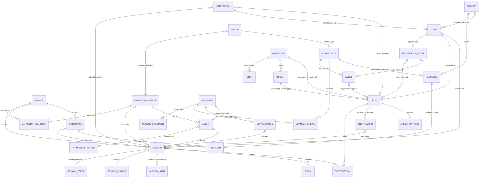

# Domain model

This document pins the shape of every Hydra domain entity: the fields the design tickets fixed, the relationships between entities and which of them are optional, the one fixed status axis each entity carries, the identity rules (Hydra ids versus provider-native and external ids), and the platform events each entity emits. Where another document owns a record's field list (Run, Step record, Notification, SessionSpec, Trigger, event envelope, memory documents, permission profiles), this document keeps purpose, relationships, status axis and identity and links the owner for the fields. Behaviour belongs to the owning subsystem document and is only pointed at here. The vocabulary is the glossary in [CONTEXT.md](../../CONTEXT.md); this document does not restate definitions.

## Model-wide rules

These rules hold for every entity below.

1. **All links are optional; no mandatory parents.** A session needs no task, run, workspace, or conversation. A run needs no task or workflow. A task needs no project. Every relationship in this document is optional unless it says "required". Rationale: the predecessor's mandatory `task_id` was its biggest structural mistake ([Domain model & ubiquitous language](https://github.com/rogierpennink/hydra/issues/6)).
2. **One fixed status axis per entity, no user-definable domain states.** Where an entity has a status, its enum is fixed by this document or the owning document it links. No entity accepts user-defined states. Kanban-style groupings, "needs a call", "proposed", tiers like Now / Today / When you can, and topic tabs are presentation over labels and fixed fields, never domain states.
3. **Labels are not states.** Labels are bare strings in a flat namespace, created implicitly on first use. There is no label registry entity; the core blesses no label (shipped workflows may use conventional ones such as `proposed`; topics are labels). Colours and descriptions of labels are presentation. A label never gates, transitions, or auto-derives a status.
4. **The controller owns all domain state; runners own material state.** Every entity here is a row in the controller's one SQLite database ([04-state-store.md](./04-state-store.md)). Workspace files, provider-native session data and the runner's event outbox live on runner disk and are referenced from the controller only by id ([03-controller-and-runners.md](./03-controller-and-runners.md), [ADR 0002](../adr/0002-orchestration-stays-on-the-controller.md)).
5. **Controller records hold no absolute paths; runner paths are runner-owned facts keyed by id.** The rules are in [04-state-store.md](./04-state-store.md) (Relocatable Data Root).
6. **Every mutation is actor-stamped** (`user` or `session:<id>`) in the event log; no entity carries a separate audit trail ([11-public-api-and-agent-surface.md](./11-public-api-and-agent-surface.md)).
7. **Secrets are references.** Fields marked "secret" hold a reference into the owner-scoped secrets table; the value never appears in any entity row, log line or API response ([13-security.md](./13-security.md)).
8. **Single user, widen later.** No entity carries an owner or tenant column in v1. The `actor` field and the user record are the places a later multi-user model widens; nothing else may assume "the user".

**Open:** the id format for Hydra-owned entities (UUID variant, ULID, or integer rowid) is not pinned. Tickets write typed references such as `run:1234` and `session:<id>` on the CLI and in actor stamps; [08-events-and-connections.md](./08-events-and-connections.md) pins the event `id` as the integer log position; the format for every other entity is a build-time choice for [04-state-store.md](./04-state-store.md) to record.

## Entity-relationship overview

In prose, the model has five clusters:

- **Work triangle**: Task (intent), Run (execution of a plan), Session (agent conversation). Any two are linked only when the link is meaningful; links live on the Run and Session side, and a Task's runs and sessions are derived by query.
- **Automation**: Workflow owns Triggers and Steps; a Run freezes an Execution Plan and holds Subscriptions; Events flow through one pipeline stamped with their Connection; Notifications are the output to the user.
- **Actors and access**: Agent (with a Permission Profile), Assistant (an Agent plus Conversations, Channel Bindings and Memory), Actor stamps, Session Tokens, API Keys, Grants and Permission Requests.
- **Organization**: Project spans Resources; Resources are checked out into Workspaces on Runners as Checkouts; Resources may reference the Connection that reaches them.
- **Infrastructure and extension**: Controller identity, Runners (with states and capabilities), Provider instances with Capability Snapshots, Plugins with their state, Connections, Secrets.

## Work

### Task

Purpose: the thin, work-type-agnostic work item that triage produces and workflows consume ([ADR 0019](../adr/0019-the-task-model-is-thin-workflows-own-task-semantics.md)).

Fields (pinned):

| Field | Type | Notes |
|---|---|---|
| `id` | Hydra id | |
| `title` | string | |
| `description` | markdown | Enrichment edits this; no comment thread in v1 |
| `status` | enum | Fixed axis, below |
| `priority` | enum | `urgent` / `high` / `normal` / `low`; optional, default `normal`; user and agents write the same field through the same op |
| `labels` | string[] | Bare strings, flat namespace, implicit creation |
| `projectId` | Hydra id, optional | At most one project |
| `provenance` | Provenance entry[] | Append-only |
| `createdAt`, `updatedAt`, `statusChangedAt` | timestamps | `statusChangedAt` moves only when `status` changes |

Not present in v1: assignee, subtasks, task-to-task dependencies, comments, a suggested-priority shadow field (the actor-stamped event log serves that need).

Status axis: `open` -> `in-progress` -> `done`, plus `cancelled`. Any-to-any transitions; no state machine enforcement; no core auto-transitions; no completion gating. Status changes only via an explicit `task.update`. "Done means the PR merged" is a shipped-workflow convention implemented by the work run's own signal trigger and a final `task.update` step ([09-tasks.md](./09-tasks.md)). `cancelled` means decided not to do; hard delete means it should never have existed, and the event log keeps the audit.

Relationships: `projectId` optional. Run and Session links to a task live on the Run and Session rows; the task's run and session lists are derived by query. Proposal (a Task labelled `proposed` plus its pending decision Notification) and Topic (a label) are vocabulary over this row, not fields.

Identity: Hydra id only. External refs live in provenance and are never unique across tasks.

Platform events: `task.created` carries a full snapshot; `task.updated` carries `{taskId, changes}` where `changes` holds `{old, new}` per changed scalar field and `{added, removed}` per changed array field; one update op emits exactly one event; provenance-only appends also emit `task.updated`. The actor is the envelope's `actor` field, not repeated in the payload ([08-events-and-connections.md](./08-events-and-connections.md), [09-tasks.md](./09-tasks.md)).

**Open:** whether a `task.deleted` platform event exists is not pinned; the v1 platform-event set names only `run.completed`, `run.failed`, `task.created`, `task.updated`.

### Provenance entry

Purpose: one append-only record of an event, run or external thing that created or touched a task.

Shape (pinned): `{ ref?: ExternalRef, eventId?: Hydra id, runId?: Hydra id, at: timestamp, actor: Actor }`. Entries are never edited or removed.

External Ref canonical form: a fully-qualified id `<type>:<kind>:<identity>`, for example `github:issue:owner/repo#42`, `gmail:thread:<id>`, `sentry:issue:123`. The plugin that defines the type owns canonicalization. The Connection an event arrived through is excluded from the identity. No uniqueness constraint across tasks: the `task.query` guard convention treats "any open task with this ref" as the duplicate signal ([09-tasks.md](./09-tasks.md), [10-triage-intake-and-notifications.md](./10-triage-intake-and-notifications.md)). Refs typically originate from the event envelope's `refs` field and are copied here by triage.

Relationships: `eventId` points into the event log (the referenced event may be TTL-pruned; the entry survives), `runId` into Runs.

**Open:** whether an entry must carry at least one of `ref`, `eventId`, `runId` is not pinned; the tickets show all three as optional.

### Run

Purpose: one execution of a frozen Execution Plan, the only thing called a run ([ADR 0001](../adr/0001-runs-freeze-an-execution-plan.md)).

Fields: the run record is owned by [07-workflows.md](./07-workflows.md) (section 7.2): `id`, `workflowId | null`, frozen `plan`, resolved `inputs`, `workspaceId?` and `runnerId?` (the run's one workspace and runner, once pinned), `origin` (trigger / manual / action / api), `triggerEvent` (a copy of the triggering event, surviving event-log pruning), `rerunOf`, `status`, `failureReason` (closed set: `validation-error`, `expression-error`, `iteration-limit`, `schema-failure`, `step-failed`, `session-failed`), `failedStepId`, `steps[]` (step records), `createdAt`, `startedAt`, `finishedAt`. Ticket 13 pins the content (frozen plan, resolved inputs, triggering event, per-step records, failure reason); the names are 07's consolidation; the execution semantics are [Workflow execution semantics](https://github.com/rogierpennink/hydra/issues/36)'s. This document adds one optional link: `taskId` (the all-links-optional work triangle; the task's run list is derived from it).

How a run was started is `origin` plus `triggerEvent`; the check-in view's provenance-first ranking (started by you > standing workflow > routine schedule) needs no further field ([14-web-app.md](./14-web-app.md)).

Status axis (mirrored from 07): `pending` -> `running` -> terminal `completed` | `failed` | `cancelled`. `pending` is the effect row the event matcher inserts before the run is scheduled ([ADR 0009](../adr/0009-all-events-flow-through-one-persisted-pipeline.md)). A run blocked on a signal is `running` with nothing running and a live Subscription; "waiting" is a derived view. `failed` is terminal (recovery is re-run). The user may cancel at any time; a run's Subscriptions live exactly until it reaches a terminal state. A run takes place in one workspace on one runner ([07-workflows.md](./07-workflows.md) section 4.4).

Re-run: whole-run only, two modes (replay the frozen plan, or re-stamp from the current workflow with the same inputs; the latter is the default). Both create a new Run referencing the original through `rerunOf`.

Relationships: `workflowId` optional; `taskId` optional; `workspaceId` and `runnerId` optional (set when the first agent step starts); agent steps link to Sessions from their step record; holds zero or more Subscriptions.

Identity: Hydra id.

Platform events: `run.completed`, `run.failed`, `run.cancelled`; payloads owned by [08-events-and-connections.md](./08-events-and-connections.md). Cancellation is not a failure and has its own kind. These are the only run kinds in v1; kinds grow additively.

#### Execution Plan

Purpose: the executable content a run executes, frozen at run start. Contents: input declarations, the step graph (steps with their `join` and `terminal` flags, edges with conditions and `maxTraversals`), the signal triggers the run will instantiate as Subscriptions (source nodes of the graph), the workspace policy and placement inputs, and the action references. Stored inline on the Run; never shared between runs and never edited. Editing a workflow never affects an existing plan. Shape and validation rules: [07-workflows.md](./07-workflows.md).

#### Step record

Purpose: what one node (step or signal trigger) did in one iteration of one run.

Fields: owned by [07-workflows.md](./07-workflows.md) (`StepRecord`): `stepId` (a step id or a signal trigger id), `iteration`, `status`, `startedAt`, `finishedAt`, `output`, `sessionId` (agent steps), `error`. The triage agent's stored structured verdict that Intake surfaces is the `output` of the triage agent step ([10-triage-intake-and-notifications.md](./10-triage-intake-and-notifications.md)). A signal node gets one `completed` record per firing, holding its mapped event.

Status axis (mirrored from 07), monotonic per record: `pending` (a queued iteration behind a busy step) -> `running` -> `completed` | `failed` | `cancelled`; `skipped` is set at creation and final. A re-entered step never leaves `completed`: the next iteration is a new record.

### Session

Purpose: one provider-backed agent conversation, resumable and forkable, the only place agent work happens.

Fields (pinned across [#6](https://github.com/rogierpennink/hydra/issues/6), [#7](https://github.com/rogierpennink/hydra/issues/7), [#12](https://github.com/rogierpennink/hydra/issues/12), [#16](https://github.com/rogierpennink/hydra/issues/16), [#17](https://github.com/rogierpennink/hydra/issues/17); names follow [06-providers.md](./06-providers.md)):

| Field | Notes |
|---|---|
| `id` | Hydra id; distinct from any provider-native id |
| `agentId` | the Agent identity whose profile the session token inherits |
| `instanceId` | provider instance; the routing key for the adapter (instance, never provider id) |
| `runnerId` | pinned where the session starts; never migrates |
| `workspaceId` | optional; `null` is a workspace-less session |
| `requestedAccessMode` | the access mode asked for by the user or the agent step |
| `accessMode` | the effective mode after the hardcoded downward fallback; equals `spec.accessMode` |
| `spec` | the controller-authored `SessionSpec`, stored byte-for-byte; fields owned by [06-providers.md](./06-providers.md) section 4 |
| `nativeSessionId` | from the Session Binding, below |
| `taskId`, `runId` + `stepId`, `conversationId` | all optional; a session may belong to none |
| `parentSessionId` | optional; set when the session was forked from another session (`continue.mode = fork`) |
| timestamps | `createdAt`, `startedAt`, `exitedAt`, `lastActivityAt` (inactivity and absolute timeouts themselves are runner-owned) |

Session-only grants approved through a Permission Request attach to the Session (see Grant).

Status axis (consolidated from pinned lifecycle facts, owned by [06-providers.md](./06-providers.md)): `queued` (placement accepted but the runner is at its session cap) | `starting` | `idle` | `busy` (a turn is running; decides whether `sendInput` opens or steers) | `exited`. `resumable` is derived: `exited` and the runner still holds the provider-native state; it becomes false when that runner is retired or wiped.

Relationships: requires `agentId`, `instanceId`, `runnerId`. Everything else optional. Holds zero or more Subscriptions (registered by the session itself through the API, or migrated from a rotated predecessor in the same Conversation). Owns its Turns and Queued Inputs. Exactly one Session Token while alive.

**Open:** whether a user-driven chat-first session can exist without an Agent row is not pinned; token -> session -> agent -> profile resolution assumes every session has an agent.

Identity: the Hydra session id and the provider-native id (Claude Code session id, Codex thread id, pi session) are separate concepts joined only by the Session Binding. All Hydra references (API, CLI, actor stamps, step records, subscriptions) use the Hydra id.

Events: none on the domain event log in v1 (no `session.*` platform events). The session's normalized event stream (`session.*`, `turn.*`, `item.*`, `content.delta`, `request.*`, `session.usage.updated`, `runtime.*`) is a separate per-session append-only stream, not the domain event log ([04-state-store.md](./04-state-store.md), [06-providers.md](./06-providers.md)).

#### Turn

Purpose: one user-visible episode of a session, from an input until the agent goes idle.

Fields (from the normalized stream, [06-providers.md](./06-providers.md)): `id` (adapter-minted where the vendor has none, native where it exists; synthetic turns for unsolicited output), `sessionId`, `state: completed | failed | interrupted`, `model?`, `usage?`, `costUsd?`, `error?`, started/completed timestamps. Turn state is the turn's fixed axis; a turn ends only by stopping, never by a single reply.

#### Queued Input

Purpose: controller-owned input waiting for the session's running turn to complete.

Fields: `sessionId`, `content` (text; for subscription deliveries also the structured event payload alongside rendered text), `source` (user input, subscription delivery, heartbeat), `createdAt`, `deliveredAt?`. Editable and cancelable until the controller flushes it on `turn.completed`; delivery rides the runner protocol's seq/ack outbox. Status axis (spec-consolidated from "editable and cancelable until delivered"): `queued` -> `delivered` | `cancelled`.

#### Session Binding

Purpose: the explicit join between a Hydra session and the provider-native object that backs it.

Shape: `SessionBinding { sessionId, nativeSessionId, instanceId }`, owned by [06-providers.md](./06-providers.md). Returned by `startSession` and by `listSessions` on runner restart for reconciliation; the runner is known from the Session row, not the binding. Provider-native transcripts stay on the runner; the controller's normalized stream is the observable record.

## Actors

### Agent

Purpose: the controller-owned identity that does work; one concept covering workflow agents and assistants.

Fields (pinned): `id`, `name`, `systemPrompt`, `instanceId` (provider instance), `permissionProfileId` (required; shipped defaults: `worker` profile for agents used in workflow agent steps, `assistant` profile for assistants). A session started for an agent takes its prompt, provider instance and profile from the agent; the agent step or the user supplies the rest of the `SessionSpec` (the agent step carries `accessMode` and an optional model override, [07-workflows.md](./07-workflows.md)).

**Open:** which session defaults an Agent carries beyond prompt, provider instance and profile (default `modelSelection`, default `accessMode`, standing `mcpServers`) versus what is supplied per session or per step is not pinned. [#6](https://github.com/rogierpennink/hydra/issues/6) lists "prompt, provider, capabilities" without expanding "capabilities". Placement requirements are settled: they live on the Workflow, per run, never on the Agent or the step ([07-workflows.md](./07-workflows.md) section 4.4).

Status axis: none.

Relationships: `permissionProfileId` required; `instanceId` required; sessions reference the agent.

### Assistant

Purpose: an Agent with channel bindings, conversations and memory, oriented to delegating work ([ADR 0014](../adr/0014-assistants-remember-through-distilled-memory-not-merged-sessions.md)).

Fields (pinned): everything an Agent has, plus a Heartbeat (`enabled`, default true; schedule; user-editable standing prompt) and rotation thresholds (context-size ceiling, mandatory; daily timer). Default profile `assistant`, loosenable per assistant. One default assistant is created at setup ([15-packaging-and-operations.md](./15-packaging-and-operations.md)). Assistant sessions are workspace-less and run with the `hydra` CLI. The heartbeat is a scheduled wake; its mechanism and target conversation are Open in [12-assistants.md](./12-assistants.md).

Status axis: none. There is no paused state in v1; removing all bindings is how an assistant is paused.

Relationships: owns Conversations, Channel Bindings and Memory documents; memory is never shared between assistants. Deleting an assistant deletes its memory (confirmed action); its sessions survive as ordinary session history.

#### Conversation

Purpose: one continuous exchange with an assistant inside one platform container, backed by a lineage of sessions.

Fields: `id`, `assistantId`, container key (the channel Connection plus the platform's container facts: guild/channel/thread id, DM id; or a web-chat id with no channel), `currentSessionId`, the ordered session lineage (successive sessions after each rotation), bounded stored context of unaddressed group messages (third-party lines, marked as data, never instructions). Conversations are never merged.

Status axis: none.

Relationships: `assistantId` required; container key required; sessions in the lineage reference it through `conversationId`. Subscriptions held by the live session migrate to the successor session on rotation, so "a subscription dies with its holder" holds for the conversation's current incarnation ([12-assistants.md](./12-assistants.md)).

#### Channel Binding

Purpose: the routing rule from part of a channel connection to exactly one assistant.

Fields: `id`, `connectionId` (a channel-type Connection: Discord, Slack), `scope` (DMs, a named channel, a thread), `assistantId`. Matching is most-specific-wins over the route facts of an incoming message. A binding is how a channel reaches an assistant; the web app reaches the same assistant without one.

#### Memory documents

Purpose: the assistant's durable notes, reached only through the API ([ADR 0020](../adr/0020-assistant-memory-is-reached-only-through-the-api.md)).

Two tiers per assistant: one `core` document and named topic documents; format, caps, injection and the taint provenance marker are owned by [12-assistants.md](./12-assistants.md) (section 6). Each document is a row keyed by (assistant, name). Status axis: none.

### Actor

Purpose: who performed an operation, stamped on every mutation in the event log.

Values: `user`, `session:<sessionId>`, `run:<runId>` (a built-in action step inside a run) or `plugin:<pluginId>` (a plugin calling in-process). Session actors are bounded by their agent's profile; the other three are ungated ([11-public-api-and-agent-surface.md](./11-public-api-and-agent-surface.md) section 3.1). A single user record (username, password hash) exists in v1 for login; there is no user entity in the API model beyond that record, and the actor value `user` is the only user identity. Multi-user widens this field; it is never restructured ([ADR 0013](../adr/0013-agents-operate-hydra-through-the-public-api.md)).

### Permission Profile, Grant, Permission Request

**Permission Profile**: `id`, `name`, `grants[]`. Attached to every Agent; inherited by every session token of that agent. Three shipped profiles (`assistant`, `worker`, `unrestricted`); their contents are the table in [13-security.md](./13-security.md).

**Grant**: one operation-family permission `{family, verbs}`, written `<family>.<verb>` (`task.delete`, `session.spawn`, `infra.write`). Families: `task`, `workflow`, `run`, `session`, `subscription`, `notification`, `event`, `connection`, `infra`, `workspace`, `agent`, `memory`, `permission`, `project`, `resource`, `secret`, `credential`; the table with verbs is in [13-security.md](./13-security.md) section 6.1. Grant families are coarser than operation families (`infra` covers runners, plugins, providers and the controller); the contract's operation-to-grant table joins them. Grants are unscoped in v1 (`memory` excepted); finer grants can be added inside a family later without breaking profiles. A grant is the unit a 403 names and an escalation asks for. A grant approved "this session only" attaches to the Session, not the profile; "add to profile" appends it to the profile.

**Permission Request**: an agent's ask for a grant (`permission.request { grant, reason, operation? }`), persisted as a Notification with bound actions (`session` / `profile` / `deny` outcomes of `permission.decide`); the request registers a subscription for the asking session, through which it learns the outcome. No blocking waits.

### Session Token

Purpose: the per-session credential whose subject is the Session.

Fields: `sessionId` (subject), token (opaque random, only its hash stored), `createdAt`, `revokedAt` (set when the session ends). Carries the agent's profile by resolution (token -> session -> agent -> profile, one indexed lookup; revoked on session end). Injected by the runner as `HYDRA_TOKEN` with `HYDRA_API_URL` and `HYDRA_SESSION=1`.

### API Key

Purpose: the user's long-lived credential for the ops CLI and scripts.

Fields: `id`, `name`, token hash (opaque random; never a JWT), `createdAt`, `lastUsedAt?`, `revokedAt?`. Always resolves to actor `user`. Minted in the web app or via `hydra login`. The web app authenticates with an opaque bearer token from password login plus a short-lived WebSocket ticket; there are no cookies ([13-security.md](./13-security.md), [14-web-app.md](./14-web-app.md), [ADR 0017](../adr/0017-the-web-app-is-a-static-pure-client-of-the-public-api.md)).

## Organization

### Project

Purpose: a grouping of related work and its materials; may span several resources.

Fields (spec-consolidated; ticket 6 pins the concept, not fields): `id`, `name`. Tasks reference a project through `projectId`; a project spans Resources.

**Open:** the Project-Resource cardinality (whether one Resource may belong to several Projects) and any further Project fields (description, default connection) are not pinned.

Status axis: none.

### Resource

Purpose: a durable external thing a project works with: a git repo, a folder, a mailbox.

Fields (pinned): `id`, `kind: repo | folder | mailbox`, `connectionId?` (the Connection used to reach it: the GitHub Connection that clones a repo, the gmail Connection of a mailbox), and for repo resources: the remote (origin) location, one optional setup command (stored here and never in the repo, run in fresh ephemeral checkouts; failure marks the workspace unusable), and the untracked-file copy convention (`.workspaceinclude`, configurable). "Resource" is a vocabulary term, not a common code interface: each kind has its own fields. A connected account can play two roles: Resource (the mailbox) and event source (its Connection's ingest).

In v1 only repo resources are checkout-able; folder resources produce no workspaces; mailboxes never produce workspaces.

Relationships: `connectionId` optional; per (resource, runner) at most one primary Workspace and one runner-owned bare cache; GitHub plugin watch lists are seeded from repo Resources.

**Open:** whether a repo Resource's identity is its remote URL (so two Resources cannot name the same remote) is not pinned.

Status axis: none.

### Workspace

Purpose: a provisioned working area on one runner in which sessions do their work ([ADR 0003](../adr/0003-sessions-run-as-bare-processes.md)).

Fields (pinned): `id`, `runnerId` (pinned to the runner it was provisioned on; never migrates), `kind: primary | ephemeral`, `checkouts[]` (0..N; a primary has exactly one; zero makes a scratch workspace; several make a multi-repo workspace with one checkout subdirectory per resource), `designatedConnectionId` (the GitHub Connection whose token becomes the session's `GH_TOKEN`; workspace-less sessions use a user-designated default Connection or none), `status`, timestamps (provisioned, last used, disposed). The on-disk path is runner-owned and is not stored on the controller. The runner-provisioned scratch directory a Codex workspace-less session needs is not a Workspace ([03-controller-and-runners.md](./03-controller-and-runners.md), [06-providers.md](./06-providers.md)).

Invariants: at most one primary workspace per (resource, runner). Primaries are standalone clones with origin at the real remote (an existing local checkout is adopted in place); ephemerals are git worktrees off the per-resource bare cache, on a branch named by the run (default `hydra/run-<runId>`; [07-workflows.md](./07-workflows.md) section 4.4). A run has exactly one workspace, shared by all its agent steps. Concurrent sessions in a workspace are allowed and surfaced, not locked.

Status axis (consolidated from the lifecycle in [03-controller-and-runners.md](./03-controller-and-runners.md), which owns the names): `provisioning` -> `ready`, and from there `unusable` (setup command failed), `kept-on-failure` (ephemeral kept until the user dismisses the failed run), `deleted` (clean completion, dismissal, or TTL reaping), `lost` (the runner was retired). Primaries are never torn down by Hydra and only ever become `lost`.

Relationships: `runnerId` required; Checkouts reference it; Sessions reference it optionally.

### Checkout

Purpose: one working copy of a single resource inside a workspace.

Fields: `id`, `workspaceId`, `resourceId`, `branch`, `form: clone | worktree` (a primary's checkout is a standalone clone; an ephemeral's is a worktree off the bare cache), subdirectory name within the workspace (multi-repo workspaces). Git identity per checkout (credential helper identity, `user.name`/`user.email`) derives from the resource's Connection at use time ([ADR 0016](../adr/0016-git-credentials-derive-from-connections.md), [13-security.md](./13-security.md)); nothing credential-shaped is stored on the checkout.

Git's one-branch-one-worktree guard applies across all ephemeral checkouts of one resource on one runner; primaries are standalone and never collide with it.

## Infrastructure

### Runner

Purpose: a daemon on one machine that hosts sessions and workspaces for the controller.

Fields (pinned by [#7](https://github.com/rogierpennink/hydra/issues/7), [#8](https://github.com/rogierpennink/hydra/issues/8)):

| Field | Notes |
|---|---|
| `id` | Hydra id; a re-enlisted machine is a new runner with a new id |
| `name` | auto-assigned (nice-to-have: mythological names), user-editable |
| credential hash | the durable per-runner credential minted at join is an opaque random token stored hashed like every other token ([13-security.md](./13-security.md)); revoked on retire. It is not a row in the secrets table; the `runner` owner kind there is reserved for runner-scoped secrets |
| `state` | fixed axis, below |
| `lastSeenAt` | shown honestly while `unreachable` |
| probed facts | OS/arch, RAM, docker presence, provider binaries and their auth state (credential-file-free probing), toolchains; self-reported at `hello`, never probed from the controller |
| `labels[]` | free-form user labels; together with probed facts these are the Runner Capabilities placement filters on |
| `maxConcurrentSessions` | default derived from probed RAM (about one session per 2 GiB, floor 1); user-overridable |
| protocol facts | negotiated protocol version and capability list from `hello`; last acked sequence number of the runner's outbox |

The controller's auto-joined local runner is an ordinary runner with no distinguishing field; "local" as a placement choice is a client-side alias ([14-web-app.md](./14-web-app.md)).

Runner-owned, not stored on the controller: the random storage directory created at enrollment, per-workspace paths, inactivity and absolute session timeouts, the disk-space watermark, the event outbox.

A fleet-level setting names the **default runner**; promotion does not change it.

Status axis (pinned): `online` / `offline` (announced shutdown: sessions cleanly interrupted and resumable, outbox flushed, work waits) / `unreachable` (silence: state unknown, last seen shown) / `draining` (no new placements, sessions finish) / `retired` (terminal: credential revoked, workspaces marked lost, session records preserved but unresumable). Force-retiring an `unreachable` runner requires explicit confirmation.

Relationships: owns Workspaces and hosts Sessions (both pinned to it); Capability Snapshots are keyed by (provider instance, runner).

Identity: Hydra id plus its credential. Retired runners keep their records; re-enlisting the same machine creates a new Runner with new identity, credential and labels and adopts no workspaces.

### Controller identity

Purpose: the logical identity runners authenticate, independent of address ([ADR 0005](../adr/0005-promotion-is-migration-behind-a-stable-controller-identity.md)).

Fields: controller `id` and signing key material created at install and carried in the promotion bundle; the current reachable address; `sealed` flag with the signed forwarding pointer to the successor address once promoted away. Runners store this identity, not an address, and accept it wherever it appears; announcements and the forwarding pointer are signed with it.

Transient tokens minted by the controller: single-use runner join tokens and single-use promotion tokens. Both are short-lived records, not credentials of any entity.

### Provider instance

Purpose: one configured provider (definition plus decoded config); the routing key for sessions ([ADR 0007](../adr/0007-provider-adapter-is-a-thin-interface-behind-a-normalized-event-stream.md)).

Fields: `instanceId` (the routing key; never the provider id), `providerId` (the ProviderDefinition id: `claude-code` | `codex` | `pi`), `config` (validated against the definition's `configSchema`; which of its entries live on the controller as logical settings and which the runner resolves to paths is the Conflict recorded in [06-providers.md](./06-providers.md)), `displayName`. A definition with `supportsMultipleInstances: false` has at most one instance. One instance is one login and one isolated provider home per runner.

**Capability Snapshot** (per instance x runner): `instanceId`, `runnerId`, `probedAt`, `declared` (copied `DeclaredCapabilities`, including `accessModes: Record<AccessMode, "native" | "unsupported">` and `structuredOutput`), `harnessVersion | null`, `auth {status, identity?, planLabel?, backend?}`, `models: ModelDescriptor[]`. Field lists are owned by [06-providers.md](./06-providers.md). Snapshots live in the controller DB; probing is runner-side and side-effect-free. The earlier `asks-instead` value is withdrawn; fallback between access modes is controller policy, hardcoded and strictly downward ([06-providers.md](./06-providers.md), [13-security.md](./13-security.md), [ADR 0007](../adr/0007-provider-adapter-is-a-thin-interface-behind-a-normalized-event-stream.md)).

Status axis: none on the instance; auth status is a snapshot fact per runner.

Relationships: registered by a provider Plugin; referenced by Agents and Sessions; snapshots reference Runners.

### Connection

Purpose: a core-owned link to one external account ([ADR 0010](../adr/0010-external-accounts-are-core-owned-connections.md)).

Fields (pinned; record owned by [08-events-and-connections.md](./08-events-and-connections.md) section 8.1): `id`, `type` (plugin-namespaced, e.g. `gmail`, `github`, `discord`, `slack`), `label` (user-facing name, e.g. "work"), `credentials` (secret references, owner `connection`), `status`, `config` (per-connection plugin config against the plugin's schema, e.g. the GitHub watched-repo list seeded from repo Resources), `labels[]` including the **default topic** chosen at setup, and for channel-type connections the user's notification-delivery toggle (the ADR 0012 sink toggle). Producer-side muting of a plugin's notifications is a plugin setting, not a connection field. A connected account can play two roles: event source (ingest) and Resource (a mailbox).

Status axis (mirrored from 08, the minimum set the sources imply): `connected` | `needs-reauth` | `error` | `disabled`. Ingest runs only in `connected`.

Relationships: defined by exactly one Plugin type; one ingest loop per connection; every Event is stamped with its `connectionId`; Triggers select connections explicitly (named or a deliberate "any", never a silent all); outbound actions name the connection they act as; Resources and Channel Bindings reference it; Workspaces designate it for git identity.

Identity: Hydra id. Two plugins wanting the same external service define two types and authenticate twice (accepted cost).

## Automation

### Event

Purpose: one fact in the single persisted event pipeline ([ADR 0009](../adr/0009-all-events-flow-through-one-persisted-pipeline.md)).

Envelope: owned by [08-events-and-connections.md](./08-events-and-connections.md) (section 2), which pins the names: `id` (integer log position), `source`, `connectionId`, `system` (writable after ingest as enrichment), `kind`, `occurredAt`, `receivedAt`, `dedupKey`, `refs: ExternalRef[]`, `url`, `payload`, `raw`, `actor`. `system` and `url` come from the Intake handoff on [#21](https://github.com/rogierpennink/hydra/issues/21).

Core-emitted kinds: `cron.tick {workflowId, triggerId, scheduledFor}`, manual synthetic events, and the platform events `run.completed`, `run.failed`, `task.created`, `task.updated`. Security and audit entries (login success/failure, token minted/revoked, permission request raised/decided, secret created/rotated) and actor-stamped mutations are entries in the same log with their own kinds; they are never triggers ([13-security.md](./13-security.md)).

Effect rows the matcher derives from an event (pending run, signal delivery, queued session input) carry `UNIQUE(triggerId, eventId)` / `UNIQUE(subscriptionId, eventId)` constraints; there is no delivered-events table ([04-state-store.md](./04-state-store.md)).

Retention: the event log and per-session streams are TTL-pruned (default 90 days); security events and actor-stamped mutations are kept at least 90 days; domain rows are never pruned; run records copy their triggering event so pruning never breaks audit. The final statement is in [04-state-store.md](./04-state-store.md).

Identity: the log position; `dedupKey` is the plugin's idempotency key per Connection, not the row identity.

Status axis: none (events are immutable except the enrichment-writable `system`).

### Subscription

Purpose: a live, correlated claim on future events held by a run or a session.

Fields: `id`, holder (`runId` or `sessionId`, exactly one), origin (the signal trigger in the run's plan that instantiated it, or session-registered through the API), for session-held ones the registered **target** (`run` / `session` / `ref` / `request`, [11-public-api-and-agent-surface.md](./11-public-api-and-agent-surface.md) section 2), the correlation (event-side expression and run-state expression, evaluated lazily at match time against current run state; unresolved references are no-match), explicit connection selection, `createdAt`, `endedAt?`.

Status axis (spec-consolidated): `live` -> `ended`. A subscription ends only when its holder reaches a terminal state or exits; there are no timeouts in v1. On assistant rotation the dying session's subscriptions move to the successor session (holder changes, subscription survives).

Delivery is non-exclusive: one event may start new runs and signal any number of subscribers. Delivery to a run is a signal; delivery to a session is Queued Input (rendered text plus structured payload), never steering by default. Registration, listing and cancellation: [11-public-api-and-agent-surface.md](./11-public-api-and-agent-surface.md).

### Trigger

Purpose: a workflow's rule for when events enter it. Triggers are queryable rows in their own table, owned by their workflow; a workflow may carry several of each kind.

Fields: owned by [07-workflows.md](./07-workflows.md) (section 2): `StartTrigger` (`source` event selector, explicit `connection` or `"any"`, `filter`, `inputs` mapping, `spawnBound { maxRuns, windowSeconds }` defaulting to about 30 per hour, `state`, and for cron `schedule` / `timezone`) and `SignalTrigger` (`source`, `connection`, `filter` as the condition shape, `correlation { event, run }`, optional `outputs` mapping). The raw event is visible to a trigger's filter and mappings, never to the plan; a signal trigger's default output is the envelope minus `raw`. A signal trigger is a source node of the graph (outgoing edges only), frozen into the plan at run start and instantiated as a Subscription; each match fires its outgoing edges and writes a step record.

Status axis (start triggers, mirrored from 07): `active` | `paused`. `paused` is set by the user or by a tripped spawn bound (breaker): matched-but-unspawned events are held visibly until the user resumes, optionally discarding the backlog. Enable/disable lives on the Workflow. Signal triggers have no status of their own; their runtime state is the Subscription.

**Open:** whether the breaker's held events are rows on the trigger or a separate held-events table is not pinned; either way `UNIQUE(triggerId, eventId)` holds.

### Workflow

Purpose: a stored, editable source of execution plans ([ADR 0008](../adr/0008-workflow-graphs-route-on-declared-outputs.md)).

Fields (pinned): `id`, `name`, `inputs` (typed declarations, including first-class Connection inputs), `triggers[]`, `steps[]`, `edges[]` (`from`, `to`, optional CEL condition, optional `maxTraversals >= 1`), `workspace` (the run's one workspace policy), `runner` (placement inputs), `enabled`. Declarative data only; no user code; no versioning (runs freeze plans instead). Validation: every cycle contains at least one capped edge; no `all`-join inside a cycle; no edge into a signal trigger; every referenced action contribution exists in the persisted contribution catalog (a disabled plugin fails validation loudly); agent-step output schemas lint against the common strict subset ([07-workflows.md](./07-workflows.md)).

Status axis: `enabled` / `disabled`, plus a derived **invalid** mark when a stored workflow stops validating after the fact (plugin disabled, agent deleted): its start triggers do not match while invalid, one Notification is raised, and the mark clears on the next successful validation. Pausing a workflow (quiet hours, maintenance) is disabling it; a disabled workflow may still be run manually. Concurrent runs per workflow are unlimited in v1.

Relationships: owns Triggers and Steps; Runs reference it optionally.

### Step

Purpose: one node of a workflow graph.

Fields: owned by [07-workflows.md](./07-workflows.md) (section 4). Both kinds carry `id`, an optional skip `condition` (a skipped step passes through: its outgoing edges are evaluated, it has no output), `join` (`any`, the default: every firing incoming edge runs a new iteration; `all`: run once when every incoming edge has fired or is dead) and `terminal` (completing it completes the run). An action step names the workflow-action contribution (`action`) and its `params`; built-in actions in v1 are `workflow.run`, `notify`, `task.create`, `task.update`, `task.query`. An agent step names the `agent`, carries the `prompt` (a `{{ }}` template), a required `accessMode` (fallback-resolved before session start), an optional `model` override, `freshSession` (opt-out of resuming the same session across iterations) and an optional `outputSchema` (the full agent-to-graph contract; without it output is final message text plus exit status). Workspace and placement are per run, on the Workflow, not per step.

Status axis: none on the definition; runtime status lives on the Step record.

### Notification

Purpose: one persisted message from Hydra to its user ([ADR 0012](../adr/0012-notifications-are-core-routed-sinks-are-dumb.md)).

Fields: owned by [10-triage-intake-and-notifications.md](./10-triage-intake-and-notifications.md) (section 7.1): `id`, `kind`, `title`, markdown `body`, `producer` (core / run step / plugin / session), `subject` entity refs, `eventId`, `actions` (empty for informational, non-empty makes it a decision), `createdAt`, `readAt`, `resolvedAt`, `resolution`. Kinds evidenced by the tickets: run failed, trigger paused (breaker), runner unreachable, permission request, decision on a Proposal, update available, plugin-raised (e.g. an expiring OAuth token).

**Bound action**: `{ id, label, operation: { op, input }, style? }`, declared at creation as a public-API contract operation plus validated input and executed by the user's click through `notification.act` as actor `user`; the shape is 10's consolidated proposal (section 7.4).

**Open:** whether an agent-authored bound operation must have been within the authoring agent's permission profile at creation time (otherwise a `worker`-profile agent can route around its profile by proposing an operation for the user to click) is not settled; [10-triage-intake-and-notifications.md](./10-triage-intake-and-notifications.md) and [13-security.md](./13-security.md) share it.

Status axis: not pinned; the record uses `readAt` / `resolvedAt` timestamps and the enum is Open in [10-triage-intake-and-notifications.md](./10-triage-intake-and-notifications.md). "Needs you" in check-in and "Needs a call" in Intake are the unresolved decisions of the same records; the notification center shows everything. No second store.

Delivery: the notification center always records; per-sink deliveries are outbox rows to enabled channel Connections (deliver-to-all-enabled in v1). Delivery attempts are not notification fields.

## Extension

### Plugin state

Purpose: what the controller persists about each installed plugin ([ADR 0006](../adr/0006-plugins-request-capabilities-and-register-contributions-in-code.md)).

Per plugin (pinned): `id` (from the manifest), `enabled` flag, `config` (validated against the manifest's config schema; change or toggle = deactivate plus reactivate), the persisted **contribution catalog** written by `register()` at every boot for every installed plugin regardless of `enabled` (contribution ids per extension point: provider, channel, event source, workflow action), a namespaced **KV store** (string key to JSON value) inside the controller DB, and plugin-owned secrets (owner `plugin`).

Status axis: `enabled` / `disabled`. Disabling removes the plugin's contributions from use everywhere; workflows referencing them fail validation loudly.

Identity: plugin id from the manifest; contributions are referenced by id across the system (a step names an action contribution, a binding names a channel contribution, a Connection names a connection type). Connection types are namespaced by their defining plugin.

### Secret

Purpose: one encrypted value in the owner-scoped secrets table ([ADR 0015](../adr/0015-secrets-are-encrypted-per-value-under-a-keychain-held-master-key.md)).

Fields: `id`, `owner {kind: connection | plugin | runner | core, id}`, `name`, ciphertext (encrypted per value under the machine's Master Key), `createdAt`, `rotatedAt?`. Entities reference secrets by id; values never leave the secrets service except to the consumer that needs them. Enumerable and extractable by the running controller for promotion export. Runner credentials are hashed tokens, not secrets rows; the `runner` owner kind is reserved for runner-scoped secrets. The owner kind for provider-instance secrets is Open in [06-providers.md](./06-providers.md).

## Status axes at a glance

| Entity | Axis | Terminal | Owner of the enum |
|---|---|---|---|
| Task | `open`, `in-progress`, `done`, `cancelled` (any-to-any) | none enforced | this document |
| Run | `pending`, `running`, `completed`, `failed`, `cancelled` | `completed`, `failed`, `cancelled` | 07 |
| Step record | `pending`, `running`, `completed`, `failed`, `skipped`, `cancelled` | last four | 07 |
| Session | `queued`, `starting`, `idle`, `busy`, `exited` (+ derived `resumable`) | `exited` | 06 |
| Turn | `completed`, `failed`, `interrupted` | all | 06 |
| Queued Input | `queued`, `delivered`, `cancelled` | `delivered`, `cancelled` | this document |
| Subscription | `live`, `ended` | `ended` | this document |
| Trigger (start) | `active`, `paused` | none | 07 |
| Workflow | `enabled`, `disabled` | none | this document |
| Runner | `online`, `offline`, `unreachable`, `draining`, `retired` | `retired` | 03 |
| Workspace | `provisioning`, `ready`, `unusable`, `kept-on-failure`, `deleted`, `lost` | `deleted`, `lost` | 03 |
| Connection | `connected`, `needs-reauth`, `error`, `disabled` | none | 08 |
| Notification | Open in 10 (timestamps `readAt` / `resolvedAt`) | | 10 |
| Plugin | `enabled`, `disabled` | none | this document |
| Agent, Assistant, Conversation, Project, Resource, Checkout, Provider instance, Event, Memory document, Permission Profile | no status axis | | |

## Identity rules at a glance

- **Hydra ids are the only ids used across the system.** API, CLI, actor stamps, step records, subscriptions and provenance all reference Hydra ids. The event `id` is the integer log position ([08-events-and-connections.md](./08-events-and-connections.md)).
- **Provider-native ids** (Claude Code session, Codex thread, pi session; native turn ids where they exist) appear only inside the Session Binding and as `providerRefs` on normalized session events.
- **External Refs** are `<type>:<kind>:<identity>`, canonicalized by the plugin that owns the type, with the Connection excluded from the identity and no uniqueness across tasks.
- **`instanceId`, not provider id,** routes sessions; a Capability Snapshot is keyed by (instance, runner).
- **Runner identity** is per enrollment: a re-enlisted machine is a new Runner; retired runners keep their records.
- **Controller identity** is logical (id plus key material), never an address.
- **Connection types and contributions** are namespaced by their defining plugin; the Connection itself is a Hydra id.
- **Workspace ids** are controller-side; the path behind a workspace id is a runner-owned fact.
- **`dedupKey`** is a plugin-supplied idempotency key per Connection, not an identity.

## Platform events by entity

| Entity | Kinds | Payload |
|---|---|---|
| Task | `task.created` | full snapshot (actor on the envelope) |
| Task | `task.updated` | `{taskId, changes}`; `{old, new}` per scalar, `{added, removed}` per array; one event per update op |
| Run | `run.completed`, `run.failed`, `run.cancelled` | owned by [08-events-and-connections.md](./08-events-and-connections.md) |
| Cron trigger (core emitter) | `cron.tick` | `{workflowId, triggerId, scheduledFor}` |
| Security (audit kinds) | login success/failure, token minted/revoked, permission request raised/decided, secret created/rotated | [13-security.md](./13-security.md) |

No other entity emits platform events in v1; the set grows additively. Sessions emit into their own normalized stream, not the domain event log. Inbound chat messages are not pipeline events in v1 (Open in [12-assistants.md](./12-assistants.md)).

## Post-v1

- Assistant paused state that preserves bindings (v1: remove bindings). Nothing in the Assistant shape forecloses it.
- Assistant memory version history (v1: none; retrofit is a history table beside the live document). Flagged for reconsideration by [#31](https://github.com/rogierpennink/hydra/issues/31) after a cap-triggered rewrite dropped content; the cheaper v1-shaped guard on record is rejecting a write that shrinks a document by more than N% unless confirmed.
- Per-agent git identity (an Agent to Connection association on unchanged plumbing).
- Multi-user: widen `actor` and add ownership; no entity assumes "the user" beyond the login record.
- Folder-resource workspaces (needs a versioning story for non-git materials); the Resource kind exists, Checkout stays git-only.
- Artifact storage held by the controller; must live inside the Data Root.
- Human-gate step, sub-workflow step, graduation ("save as workflow"), per-workflow concurrency controls, automatic retries, partial re-run.
- Subscription timeouts (v1: a forever-waiting run is visible and cancelable).
- Platform-auto subscription detection (v1: explicit registration is the primitive).
- Presentation-layer groupings over the task status axis (kanban columns); never domain states.
- Presence-aware notification routing; the sink contract grows additively (device class, presence, receipts).
- Feedback-driven triage learning feeding assistant memory.
- Cross-assistant recall as agent-to-agent communication, never shared memory.

## Sources

Tickets:

- [Domain model & ubiquitous language](https://github.com/rogierpennink/hydra/issues/6)
- [Controller/runner architecture: registration, placement, scheduling](https://github.com/rogierpennink/hydra/issues/7)
- [Runner execution substrate](https://github.com/rogierpennink/hydra/issues/8)
- [Controller state store](https://github.com/rogierpennink/hydra/issues/9)
- [Controller promotion & portability](https://github.com/rogierpennink/hydra/issues/10)
- [Plugin architecture: API shape, loading, dogfooding](https://github.com/rogierpennink/hydra/issues/11)
- [Provider adapter interface](https://github.com/rogierpennink/hydra/issues/12)
- [Workflow model: recipes, triggers, human gates](https://github.com/rogierpennink/hydra/issues/13)
- [Event & trigger ingress design](https://github.com/rogierpennink/hydra/issues/14)
- [Triage engine & user-set bounds](https://github.com/rogierpennink/hydra/issues/15)
- [Agent-operates-system surface](https://github.com/rogierpennink/hydra/issues/16)
- [Assistant design: memory, identity, channel binding](https://github.com/rogierpennink/hydra/issues/17)
- [Security & secrets model](https://github.com/rogierpennink/hydra/issues/18)
- [Web app architecture: observability-first, desktop-shell-ready](https://github.com/rogierpennink/hydra/issues/19)
- [Prototype: the check-in view](https://github.com/rogierpennink/hydra/issues/20)
- [Assemble the v1 spec](https://github.com/rogierpennink/hydra/issues/21) (Intake and memory handoffs)
- [Controller packaging & install story](https://github.com/rogierpennink/hydra/issues/24)
- [Task model: shape, status axis, lifecycle, provenance](https://github.com/rogierpennink/hydra/issues/29)
- [Prototype: the Intake view](https://github.com/rogierpennink/hydra/issues/30)
- [Prototype: assistant memory interface](https://github.com/rogierpennink/hydra/issues/31)

ADRs:

- [ADR 0001 Runs freeze an execution plan](../adr/0001-runs-freeze-an-execution-plan.md)
- [ADR 0002 Orchestration stays on the controller](../adr/0002-orchestration-stays-on-the-controller.md)
- [ADR 0003 Sessions run as bare processes](../adr/0003-sessions-run-as-bare-processes.md)
- [ADR 0004 Controller state lives in one SQLite database](../adr/0004-controller-state-lives-in-one-sqlite-database.md)
- [ADR 0005 Promotion is migration behind a stable controller identity](../adr/0005-promotion-is-migration-behind-a-stable-controller-identity.md)
- [ADR 0006 Plugins request capabilities and register contributions in code](../adr/0006-plugins-request-capabilities-and-register-contributions-in-code.md)
- [ADR 0007 Provider adapter is a thin interface behind a normalized event stream](../adr/0007-provider-adapter-is-a-thin-interface-behind-a-normalized-event-stream.md)
- [ADR 0008 Workflow graphs route on declared outputs](../adr/0008-workflow-graphs-route-on-declared-outputs.md)
- [ADR 0009 All events flow through one persisted pipeline](../adr/0009-all-events-flow-through-one-persisted-pipeline.md)
- [ADR 0010 External accounts are core-owned Connections](../adr/0010-external-accounts-are-core-owned-connections.md)
- [ADR 0011 Triage is a workflow pattern inside core-enforced bounds](../adr/0011-triage-is-a-workflow-pattern-inside-core-enforced-bounds.md)
- [ADR 0012 Notifications are core-routed; sinks are dumb](../adr/0012-notifications-are-core-routed-sinks-are-dumb.md)
- [ADR 0013 Agents operate Hydra through the public API](../adr/0013-agents-operate-hydra-through-the-public-api.md)
- [ADR 0014 Assistants remember through distilled memory, not merged sessions](../adr/0014-assistants-remember-through-distilled-memory-not-merged-sessions.md)
- [ADR 0015 Secrets are encrypted per-value under a keychain-held master key](../adr/0015-secrets-are-encrypted-per-value-under-a-keychain-held-master-key.md)
- [ADR 0016 Git credentials derive from Connections](../adr/0016-git-credentials-derive-from-connections.md)
- [ADR 0017 The web app is a static pure client of the public API](../adr/0017-the-web-app-is-a-static-pure-client-of-the-public-api.md)
- [ADR 0019 The task model is thin; workflows own task semantics](../adr/0019-the-task-model-is-thin-workflows-own-task-semantics.md)
- [ADR 0020 Assistant memory is reached only through the API](../adr/0020-assistant-memory-is-reached-only-through-the-api.md)
